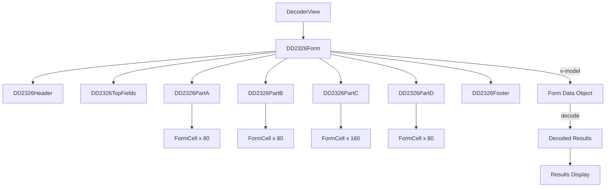

# DD Form 2326 Component Specifications

## Component Architecture

### Component Hierarchy

```
src/components/dd2326/
├── DD2326Form.vue (Main container)
│   ├── DD2326Header.vue
│   ├── DD2326TopFields.vue
│   ├── DD2326PartA.vue
│   ├── DD2326PartB.vue
│   ├── DD2326PartC.vue
│   ├── DD2326PartD.vue
│   └── DD2326Footer.vue
└── shared/
    ├── FormCell.vue (Reusable cell component)
    ├── FormRow.vue (Reusable row component)
    └── CellNumbering.vue (Cell number display)
```

## Component Specifications

### 1. DD2326Form.vue

**Purpose:** Main container component that assembles all form sections

**Props:**
```javascript
{
  modelValue: {
    type: Object,
    required: true,
    default: () => ({})
  },
  readonly: {
    type: Boolean,
    default: false
  },
  showCellNumbers: {
    type: Boolean,
    default: true
  }
}
```

**Emits:**
- `update:modelValue` - When form data changes

**Template Structure:**
```vue
<div class="dd2326-form">
  <DD2326Header />
  <DD2326TopFields v-model="formData.topFields" />
  <DD2326PartA v-model="formData.partA" />
  <DD2326PartB v-model="formData.partB" />
  <DD2326PartC v-model="formData.partC" />
  <DD2326PartD v-model="formData.partD" />
  <DD2326Footer @reset="handleReset" />
</div>
```

**Styling:**
```css
.dd2326-form {
  background: white;
  border: 2px solid black;
  font-family: Arial, sans-serif;
  max-width: 1200px;
  margin: 0 auto;
}
```

---

### 2. DD2326Header.vue

**Purpose:** Form header with approval stamp, title, and OMB information

**Template Structure:**
```vue
<div class="form-header">
  <table class="header-table">
    <tr>
      <td class="approval-stamp">
        <div class="stamp-label">APPROVAL STAMP</div>
      </td>
      <td class="title-section">
        <h1>PRESERVATION AND PACKING DATA</h1>
        <p class="omb-notice">
          The public reporting burden for this collection of information...
        </p>
      </td>
      <td class="omb-info">
        <div>Form Approved</div>
        <div>OMB No. 0704-0188</div>
      </td>
    </tr>
  </table>
</div>
```

**Styling:**
```css
.form-header {
  border-bottom: 2px solid black;
}

.header-table {
  width: 100%;
  border-collapse: collapse;
}

.header-table td {
  border: 1px solid black;
  padding: 8px;
  vertical-align: top;
}

.approval-stamp {
  width: 15%;
  text-align: center;
  font-weight: bold;
  font-size: 11px;
}

.title-section {
  width: 60%;
  text-align: center;
}

.title-section h1 {
  font-size: 14px;
  font-weight: bold;
  margin: 0 0 8px 0;
}

.omb-notice {
  font-size: 8px;
  text-align: left;
  line-height: 1.3;
  margin: 0;
}

.omb-info {
  width: 25%;
  text-align: center;
  font-size: 10px;
}
```

---

### 3. DD2326TopFields.vue

**Purpose:** Nomenclature and configuration fields section

**Props:**
```javascript
{
  modelValue: {
    type: Object,
    default: () => ({
      nomenclature: '',
      designActivityPartNumber: '',
      manufacturersCageCode: '',
      configurationItemSpecNumber: ''
    })
  }
}
```

**Template Structure:**
```vue
<div class="top-fields">
  <table class="fields-table">
    <tr>
      <td class="field-label">NOMENCLATURE</td>
      <td class="field-label">DESIGN ACTIVITY'S PART NUMBER</td>
    </tr>
    <tr>
      <td class="field-input">
        <input v-model="localValue.nomenclature" />
      </td>
      <td class="field-input">
        <input v-model="localValue.designActivityPartNumber" />
      </td>
    </tr>
    <tr>
      <td class="field-label">MANUFACTURER'S CAGE CODE</td>
      <td class="field-label">CONFIGURATION ITEM SPECIFICATION NUMBER</td>
    </tr>
    <tr>
      <td class="field-input">
        <input v-model="localValue.manufacturersCageCode" />
      </td>
      <td class="field-input">
        <input v-model="localValue.configurationItemSpecNumber" />
      </td>
    </tr>
  </table>
</div>
```

**Styling:**
```css
.top-fields {
  border-bottom: 2px solid black;
}

.fields-table {
  width: 100%;
  border-collapse: collapse;
}

.field-label {
  border: 1px solid black;
  background: #e8e8e8;
  padding: 4px 8px;
  font-size: 10px;
  font-weight: bold;
  width: 50%;
}

.field-input {
  border: 1px solid black;
  padding: 2px;
}

.field-input input {
  width: 100%;
  border: none;
  padding: 4px;
  font-family: 'Courier New', monospace;
  font-size: 12px;
}
```

---

### 4. DD2326PartA.vue

**Purpose:** Item Identification Data (Part A) with two rows

**Props:**
```javascript
{
  modelValue: {
    type: Object,
    default: () => ({
      rowA: {
        docCon: Array(8).fill(''),
        fsc: Array(2).fill(''),
        niin: Array(9).fill(''),
        addl: '',
        itemWeight: { pounds: '', unit: '' },
        length: { inches: '', unit: '' },
        width: { inches: '', unit: '' },
        depth: { inches: '', unit: '' },
        cat: ''
      },
      rowCont: {
        code: '',
        qup: '',
        icq: '',
        cage: '',
        drawingOrPartNumber: '',
        p: ''
      }
    })
  }
}
```

**Template Structure:**
```vue
<div class="part-a">
  <!-- Section Header -->
  <div class="section-header">
    ITEM IDENTIFICATION DATA (PART A)
  </div>
  
  <!-- Column Headers Row -->
  <table class="part-a-table">
    <thead>
      <tr class="column-headers">
        <th rowspan="2" class="doc-con-header">DOC CON</th>
        <th colspan="3" class="nsn-header">NATIONAL STOCK NUMBER</th>
        <th colspan="2" class="weight-header">ITEM WEIGHT</th>
        <th colspan="2" class="length-header">LENGTH</th>
        <th colspan="2" class="width-header">WIDTH</th>
        <th colspan="2" class="depth-header">DEPTH</th>
        <th rowspan="2" class="cat-header">CAT</th>
      </tr>
      <tr class="sub-headers">
        <th class="fsc-header">FSC</th>
        <th class="niin-header">NIIN</th>
        <th class="addl-header">ADDL</th>
        <th class="pounds-header">POUNDS</th>
        <th class="unit-header">UNIT</th>
        <th class="inches-header">INCHES</th>
        <th class="unit-header">10th</th>
        <th class="inches-header">INCHES</th>
        <th class="unit-header">10th</th>
        <th class="inches-header">INCHES</th>
        <th class="unit-header">10th</th>
      </tr>
    </thead>
    
    <!-- Row A with cell numbers 1-40 -->
    <tbody>
      <tr class="data-row">
        <td class="row-label">A</td>
        <td v-for="i in 40" :key="i" class="data-cell">
          <div class="cell-number">{{ i }}</div>
          <input 
            v-model="cells[i-1]" 
            maxlength="1"
            @input="handleInput(i-1)"
          />
        </td>
      </tr>
      
      <!-- Second row with different headers -->
      <tr class="column-headers-2">
        <th class="code-header">CODE</th>
        <th class="qup-header">QUP</th>
        <th class="icq-header">ICQ</th>
        <th class="cage-header">CAGE</th>
        <th colspan="19" class="drawing-header">DRAWING OR PART NUMBER</th>
        <th class="p-header">P</th>
      </tr>
      
      <!-- Row continuation with cells 41-80 -->
      <tr class="data-row">
        <td v-for="i in 40" :key="i+40" class="data-cell">
          <div class="cell-number">{{ i + 40 }}</div>
          <input 
            v-model="cells[i+39]" 
            maxlength="1"
            @input="handleInput(i+39)"
          />
        </td>
      </tr>
    </tbody>
  </table>
</div>
```

**Styling:**
```css
.part-a {
  border-bottom: 2px solid black;
}

.section-header {
  background: white;
  border: 1px solid black;
  border-bottom: 2px solid black;
  padding: 6px;
  text-align: center;
  font-weight: bold;
  font-size: 11px;
}

.part-a-table {
  width: 100%;
  border-collapse: collapse;
}

.column-headers th {
  border: 1px solid black;
  background: #e8e8e8;
  padding: 4px 2px;
  font-size: 9px;
  font-weight: bold;
  text-align: center;
}

.row-label {
  border: 1px solid black;
  background: #e8e8e8;
  font-weight: bold;
  text-align: center;
  width: 30px;
  font-size: 14px;
}

.data-cell {
  border: 1px solid black;
  padding: 0;
  position: relative;
  width: 20px;
  height: 30px;
}

.cell-number {
  position: absolute;
  top: 1px;
  left: 2px;
  font-size: 7px;
  color: #666;
  pointer-events: none;
}

.data-cell input {
  width: 100%;
  height: 100%;
  border: none;
  text-align: center;
  font-family: 'Courier New', monospace;
  font-size: 12px;
  padding: 12px 0 0 0;
  background: transparent;
}

.data-cell input:focus {
  background: #e3f2fd;
  outline: 2px solid #2196f3;
}
```

---

### 5. DD2326PartB.vue

**Purpose:** Preservation-Packing Data (Part B) with two rows

**Similar structure to Part A but with different field headers:**

**Column Headers Row 1:**
- DOC CON
- NATIONAL STOCK NUMBER (FSC, NIIN, ADDL)
- PRES METH
- C
- PRES MTL
- WRAP MTL
- CUSH DUNN
- C
- UNIT CONT

**Column Headers Row 2:**
- INT TYPE
- U
- SPEC MKG
- PACKING (A, B, C)
- UNIT PACK WEIGHT (LBS, UNIT)
- UNIT PACK SIZE (LENGTH, WIDTH, DEPTH, UNIT)
- UNIT PACK CUBE (WHOLE CUBE, 100th, CU. FT.)
- O
- P

---

### 6. DD2326PartC.vue

**Purpose:** Supplemental Data (Part C) with instruction fields

**Template Structure:**
```vue
<div class="part-c">
  <div class="section-header">
    SUPPLEMENTAL DATA (PART C)
  </div>
  
  <table class="part-c-table">
    <thead>
      <tr class="column-headers">
        <th rowspan="2" class="doc-con-header">DOC CON</th>
        <th colspan="3" class="nsn-header">NATIONAL STOCK NUMBER</th>
        <th rowspan="2" class="instructions-header">SUPPLEMENTAL INSTRUCTIONS</th>
      </tr>
      <tr class="sub-headers">
        <th class="fsc-header">FSC</th>
        <th class="niin-header">NIIN</th>
        <th class="addl-header">ADDL</th>
      </tr>
    </thead>
    
    <tbody>
      <!-- Row C with cells 1-80 -->
      <tr class="data-row">
        <td class="row-label">C</td>
        <td v-for="i in 80" :key="i" class="data-cell">
          <div class="cell-number">{{ i }}</div>
          <input v-model="cells[i-1]" maxlength="1" />
        </td>
      </tr>
      
      <!-- Supplemental Instructions header -->
      <tr class="column-headers">
        <th colspan="81" class="instructions-header">SUPPLEMENTAL INSTRUCTIONS</th>
      </tr>
      
      <!-- Continuation row with cells 41-80 -->
      <tr class="data-row">
        <td v-for="i in 80" :key="i+80" class="data-cell">
          <div class="cell-number">{{ i + 40 }}</div>
          <input v-model="cells[i+79]" maxlength="1" />
        </td>
      </tr>
    </tbody>
  </table>
</div>
```

---

### 7. DD2326PartD.vue

**Purpose:** Special Packaging Instruction Data (Part D)

**Column Headers Row 1:**
- DOC CON
- NATIONAL STOCK NUMBER (FSC, NIIN, ADDL)
- PKG DESIGN ACT CAGE
- SPI NUMBER
- B
- Y

**Column Headers Row 2:**
- SPI DATE
- CONTAINER NATIONAL STOCK NUMBER (FSC, NIIN, ADDL)

---

### 8. DD2326Footer.vue

**Purpose:** Form footer with form number, date, and reset button

**Template Structure:**
```vue
<div class="form-footer">
  <table class="footer-table">
    <tr>
      <td class="form-number">DD FORM 2326, SEP 1997</td>
      <td class="obsolete-notice">PREVIOUS EDITIONS ARE OBSOLETE.</td>
      <td class="reset-button">
        <button @click="$emit('reset')">Reset</button>
      </td>
    </tr>
  </table>
</div>
```

**Styling:**
```css
.form-footer {
  border-top: 2px solid black;
}

.footer-table {
  width: 100%;
  border-collapse: collapse;
}

.footer-table td {
  padding: 8px;
  font-size: 10px;
}

.form-number {
  font-weight: bold;
  width: 30%;
}

.obsolete-notice {
  text-align: center;
  width: 50%;
}

.reset-button {
  text-align: right;
  width: 20%;
}

.reset-button button {
  padding: 4px 12px;
  border: 1px solid black;
  background: white;
  cursor: pointer;
  font-size: 10px;
}

.reset-button button:hover {
  background: #f0f0f0;
}
```

---

## Shared Components

### FormCell.vue

**Purpose:** Reusable cell component with number display

**Props:**
```javascript
{
  cellNumber: Number,
  modelValue: String,
  showNumber: {
    type: Boolean,
    default: true
  },
  readonly: {
    type: Boolean,
    default: false
  }
}
```

**Template:**
```vue
<div class="form-cell">
  <div v-if="showNumber" class="cell-number">{{ cellNumber }}</div>
  <input 
    :value="modelValue"
    @input="$emit('update:modelValue', $event.target.value)"
    :readonly="readonly"
    maxlength="1"
  />
</div>
```

---

## Data Flow Diagram



---

## Responsive Behavior

### Desktop (> 1200px)
- Form displays at full width
- All cells visible
- No horizontal scroll needed

### Tablet (768px - 1200px)
- Form scales down proportionally
- Horizontal scroll enabled
- Maintain aspect ratio

### Mobile (< 768px)
- Form in scrollable container
- Consider zoom controls
- Maintain cell structure

---

## Print Styles

```css
@media print {
  .dd2326-form {
    border: 2px solid black;
    page-break-inside: avoid;
  }
  
  .data-cell input {
    border: none;
    background: transparent;
  }
  
  /* Hide interactive elements */
  .reset-button button {
    display: none;
  }
  
  /* Ensure black borders print */
  * {
    -webkit-print-color-adjust: exact;
    print-color-adjust: exact;
  }
}
```

---

## Accessibility Features

1. **ARIA Labels:** All input fields have descriptive labels
2. **Keyboard Navigation:** Tab order follows logical flow
3. **Screen Reader Support:** Field descriptions announced
4. **Focus Indicators:** Clear visual focus states
5. **Color Contrast:** Meets WCAG AA standards

---

## Performance Optimizations

1. **Virtual Scrolling:** For large cell arrays (if needed)
2. **Debounced Input:** Reduce update frequency
3. **Lazy Loading:** Load sections as needed
4. **Memoization:** Cache computed values
5. **Event Delegation:** Single listener for cell inputs

---

## Testing Strategy

### Unit Tests
- Test each component in isolation
- Verify data binding
- Test input validation
- Check event emissions

### Integration Tests
- Test form assembly
- Verify data flow between components
- Test decode functionality
- Check export features

### Visual Regression Tests
- Compare rendered form to reference image
- Check border alignment
- Verify cell spacing
- Test print output

### Accessibility Tests
- Screen reader compatibility
- Keyboard navigation
- Focus management
- ARIA attribute validation
