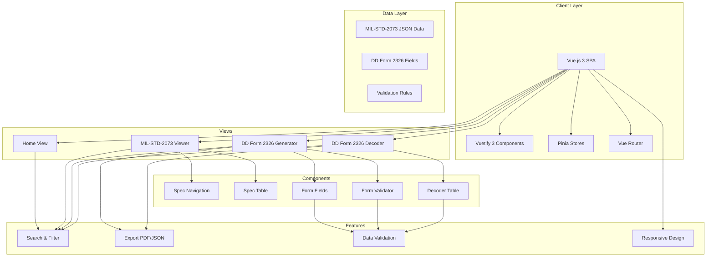
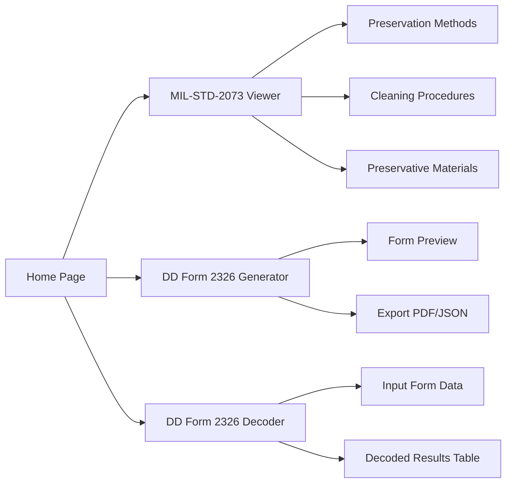
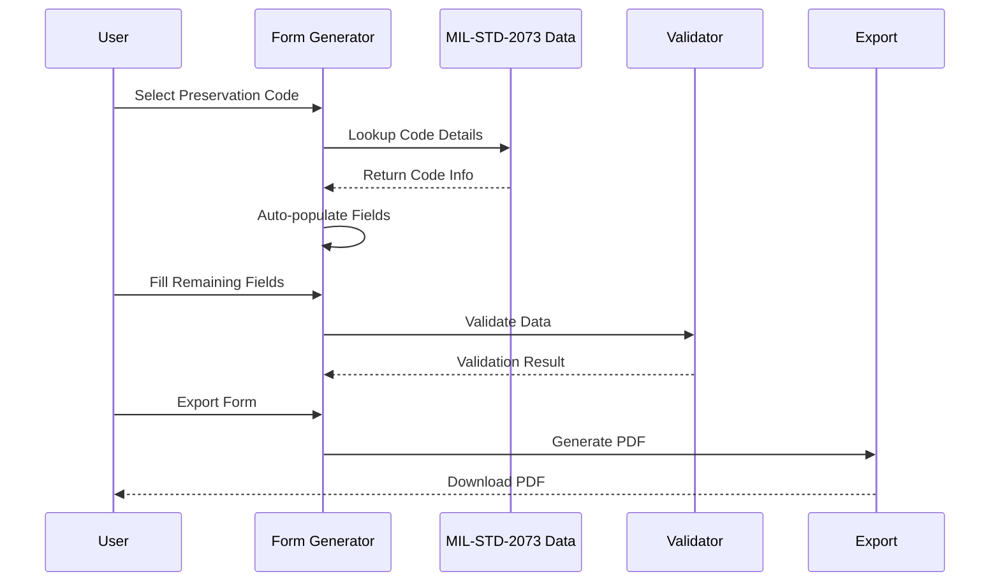

# mil-specs.com - Implementation Plan

## Project Overview

A Vue.js 3 single-page application for managing MIL specifications with focus on MIL-STD-2073 and DD Form 2326.

## System Architecture



## Navigation Flow



## Data Flow - Form Generation



## Implementation Phases

### Phase 1: Foundation (Week 1)
- Initialize Vue 3 + Vite project
- Install and configure Vuetify 3
- Set up Vue Router and Pinia
- Create basic layout (header, navigation, footer)
- Implement home page with hero section

**Deliverables:**
- Working project scaffold
- Basic routing setup
- Home page implementation

### Phase 2: MIL-STD-2073 Viewer (Week 2)
- Create data files for preservation methods
- Build spec navigation component
- Implement spec viewer with tables
- Add search and filter functionality
- Add copy code functionality

**Deliverables:**
- Working spec viewer
- Searchable code tables
- Navigation between sections

### Phase 3: DD Form 2326 Generator (Week 3)
- Create form field components
- Implement validation logic
- Build form wizard/interface
- Add auto-population from codes
- Implement export functionality

**Deliverables:**
- Working form generator
- Validation feedback
- PDF export

### Phase 4: DD Form 2326 Decoder (Week 4)
- Create decoder input component
- Implement parsing logic
- Build decoded result table
- Add search and filter
- Link to MIL-STD-2073 references

**Deliverables:**
- Working decoder
- Structured result display
- Reference linking

### Phase 5: Polish & Testing (Week 5)
- Performance optimization
- Accessibility compliance
- Cross-browser testing
- Mobile responsiveness testing
- Documentation

**Deliverables:**
- Production-ready application
- Test coverage report
- Documentation

## Component Hierarchy

```
App.vue
├── AppHeader
├── AppNavigation (v-navigation-drawer)
├── v-main
│   ├── HomeView
│   │   ├── HeroSection
│   │   ├── FeaturesSection
│   │   └── QuickLinks
│   ├── MilSpecView
│   │   ├── SpecNavigation
│   │   └── SpecViewer
│   │       ├── SpecSection
│   │       └── SpecTable
│   ├── FormGeneratorView
│   │   ├── FormField (multiple)
│   │   ├── FormPreview
│   │   └── ExportButton
│   └── DecoderView
│       ├── DecoderInput
│       └── DecoderResult
│           └── DecoderTable
└── AppFooter
```

## Key Data Structures

### Preservation Method Code
```javascript
{
  code: "20",
  description: "Preservative coating...",
  category: "Method",
  group: "Basic",
  keywords: ["preservative", "coating"],
  relatedCodes: ["21", "22"],
  specReference: "5.2.2.2"
}
```

### DD Form 2326 Field
```javascript
{
  id: "qup",
  label: "Quality per Unit Pack (QUP)",
  type: "text",
  required: true,
  validation: "^[A-Z0-9]{1,4}$",
  helpText: "Enter the QUP code",
  milStdReference: "Appendix E, Section 1"
}
```

## Development Commands

```bash
# Install dependencies
npm install

# Start development server
npm run dev

# Build for production
npm run build

# Preview production build
npm run preview

# Run tests
npm run test

# Lint code
npm run lint
```

## Environment Variables

```env
VITE_APP_TITLE=mil-specs.com
VITE_APP_VERSION=1.0.0
```

## Success Criteria

1. **Home Page**: Professional introduction with clear navigation
2. **Spec Viewer**: Searchable MIL-STD-2073 code tables
3. **Form Generator**: Complete DD Form 2326 with validation
4. **Decoder**: Accurate parsing and display of form data
5. **Responsive**: Works on desktop, tablet, and mobile
6. **Performance**: Fast load times and smooth interactions
7. **Accessibility**: WCAG 2.1 compliant

## Risk Mitigation

| Risk | Mitigation |
|------|------------|
| Complex validation logic | Comprehensive unit tests |
| Large data sets | Virtual scrolling, pagination |
| Cross-browser issues | Browser testing matrix |
| Performance issues | Lazy loading, code splitting |
| Data accuracy | Source document verification |

## Next Steps

1. **Approve Plan**: Review and approve architecture
2. **Setup Environment**: Initialize development environment
3. **Phase 1**: Begin foundation work
4. **Iterate**: Review progress weekly
5. **Deliver**: Complete Phase 5 and deploy
