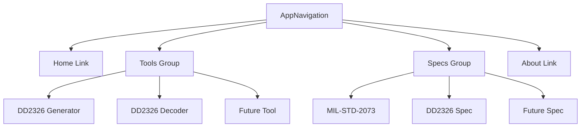

# Military Specification Management Application - Modular Architecture Design

## 1. Executive Summary

This document presents a comprehensive modular architecture for the mil-specs.com Vue.js application. The current implementation has several architectural issues that limit extensibility, maintainability, and the ability to add new specification types beyond MIL-STD-2073 and DD Form 2326.

The proposed architecture introduces:

- **Specification Plugin Pattern**: A framework for adding new specification types as plugins
- **Separated Navigation Views**: Clear distinction between Tools and Specifications
- **Abstracted Data Layer**: Specification-agnostic data loading and storage
- **Component Interface Contracts**: Base interfaces ensuring consistency
- **Incremental Migration Strategy**: Phased approach minimizing breaking changes

## 2. Current State Analysis

### 2.1 Identified Weaknesses

| Issue | Impact | Location |
|-------|--------|----------|
| Hard-coded MIL-STD-2073 loading in specs.js | Cannot support multiple specs | `src/stores/specs.js:47-66` |
| Duplicate DD2326 components | Maintenance burden | `RawDataGrid.vue`, `FormGridInput.vue`, `DD2326Form.vue` |
| No data persistence | Forms lost on refresh | All form components |
| Tight coupling | New specs require major refactoring | Components reference specific specs |
| Mixed navigation | Unclear distinction between tools and specs | `AppNavigation.vue` |
| Missing feature sections | Navigation promises unimplemented content | `AppNavigation.vue:42-61` |

### 2.2 Current Dependencies

```json
{
  "vue": "^3.4.0",
  "vue-router": "^4.2.5",
  "pinia": "^2.1.7",
  "vuetify": "^3.4.0",
  "@mdi/font": "^7.4.0",
  "axios": "^1.6.0",
  "jspdf": "^2.5.1",
  "jspdf-autotable": "^3.8.1"
}
```

## 3. New Directory Structure

### 3.1 ASCII Tree Representation

```
src/
├── assets/
│   ├── styles/
│   │   ├── _variables.scss
│   │   ├── _mixins.scss
│   │   └── theme.scss
│   └── images/
├── components/
│   ├── common/                    # Shared across all specs
│   │   ├── AppHeader.vue
│   │   ├── AppNavigation.vue
│   │   ├── AppFooter.vue
│   │   ├── BaseTable.vue
│   │   ├── SearchBar.vue
│   │   ├── LoadingSpinner.vue
│   │   ├── HelpDialog.vue
│   │   └── ExportButton.vue
│   ├── tools/                     # Application tools (DD2326 Generator, Decoder)
│   │   ├── FormGenerator.vue
│   │   ├── FormPreview.vue
│   │   ├── DecoderInput.vue
│   │   ├── DecoderResults.vue
│   │   └── DataGrid.vue
│   ├── plugins/                   # Specification plugins
│   │   ├── mil-std-2073/
│   │   │   ├── index.js           # Plugin registration
│   │   │   ├── types.ts           # TypeScript definitions
│   │   │   ├── components/
│   │   │   │   ├── SpecViewer.vue
│   │   │   │   ├── SpecSection.vue
│   │   │   │   ├── MethodsTable.vue
│   │   │   │   ├── CleaningTable.vue
│   │   │   │   ├── PreservationTable.vue
│   │   │   │   ├── WrappingTable.vue
│   │   │   │   ├── CushioningTable.vue
│   │   │   │   └── ContainersTable.vue
│   │   │   ├── composables/
│   │   │   │   ├── useMethods.js
│   │   │   │   ├── useCleaning.js
│   │   │   │   └── usePreservation.js
│   │   │   ├── data/
│   │   │   │   ├── methods.json
│   │   │   │   ├── cleaning.json
│   │   │   │   ├── preservation.json
│   │   │   │   ├── wrapping.json
│   │   │   │   ├── cushioning.json
│   │   │   │   └── containers.json
│   │   │   └── router/
│   │   │       └── routes.js
│   │   ├── dd2326/
│   │   │   ├── index.js
│   │   │   ├── types.ts
│   │   │   ├── components/
│   │   │   │   ├── FormDisplay.vue
│   │   │   │   ├── FormHeader.vue
│   │   │   │   ├── FormTopFields.vue
│   │   │   │   ├── PartA.vue
│   │   │   │   ├── PartB.vue
│   │   │   │   ├── PartC.vue
│   │   │   │   ├── PartD.vue
│   │   │   │   └── FormFooter.vue
│   │   │   ├── composables/
│   │   │   │   ├── useFormGenerator.js
│   │   │   │   └── useFormDecoder.js
│   │   │   └── router/
│   │   │       └── routes.js
│   │   └── sorm/                   # Future spec example
│   │       ├── index.js
│   │       ├── types.ts
│   │       └── components/
│   ├── layout/
│   │   ├── DefaultLayout.vue
│   │   ├── SpecLayout.vue
│   │   └── ToolLayout.vue
│   └── shared/                     # Shared across specs and tools
│       ├── DataTable.vue
│       ├── FormField.vue
│       ├── CodeSelector.vue
│       └── ExportControls.vue
├── composables/                    # Global composables
│   ├── usePersistence.js
│   ├── useExport.js
│   ├── useNavigation.js
│   └── useSpecs.js
├── plugins/
│   ├── specs/
│   │   ├── index.js               # Plugin system entry
│   │   ├── adapter.js             # Specification adapter
│   │   ├── registry.js            # Spec registry
│   │   └── loader.js              # Dynamic loader
│   └── vuetify.js
├── router/
│   ├── index.js                   # Main router
│   ├── routes/                    # Route definitions
│   │   ├── index.js
│   │   ├── tools.js
│   │   └── specs.js
│   └── guards/
│       ├── auth.js
│       └── navigation.js
├── stores/
│   ├── ui.js                      # UI state (theme, drawer, notifications)
│   ├── forms.js                   # Form persistence state
│   ├── specs.js                   # Cross-spec state
│   └── persistence.js             # Data persistence layer
├── types/                         # TypeScript definitions
│   ├── spec.d.ts
│   ├── component.d.ts
│   └── form.d.ts
├── utils/
│   ├── validators.js
│   ├── formatters.js
│   ├── constants.js
│   └── helpers.js
├── views/
│   ├── HomeView.vue
│   ├── tools/
│   │   ├── ToolsNavigationView.vue
│   │   ├── FormGeneratorView.vue
│   │   ├── DecoderView.vue
│   │   └── ExportView.vue
│   ├── specs/
│   │   ├── SpecsNavigationView.vue
│   │   ├── SpecViewerView.vue
│   │   └── SpecCompareView.vue
│   └── system/
│       ├── AboutView.vue
│       └── SettingsView.vue
├── App.vue
└── main.js

public/
├── data/
│   ├── mil-std-2073/
│   │   ├── methods.json
│   │   ├── cleaning.json
│   │   ├── preservation.json
│   │   ├── wrapping.json
│   │   ├── cushioning.json
│   │   └── containers.json
│   └── dd2326/
│       └── fields.json
└── favicon.svg
```

### 3.2 Key Structural Changes

| Old Location | New Location | Purpose |
|--------------|--------------|---------|
| `components/dd2326/*` | `plugins/dd2326/components/*` | Isolated spec-specific components |
| `components/milspec/*` | `plugins/mil-std-2073/components/*` | Isolated spec-specific components |
| `components/common/*` | `components/common/*` | Shared components unchanged |
| `views/MilSpecView.vue` | `views/specs/SpecViewerView.vue` | Unified spec viewer |
| `stores/specs.js` | `stores/specs.js` + `plugins/specs/registry.js` | Abstracted spec loading |

## 4. Core Architecture Patterns

### 4.1 Specification Plugin Pattern

The plugin pattern enables dynamic registration and discovery of specification types at runtime.

```javascript
// plugins/specs/index.js

import { SpecRegistry } from './registry'
import { SpecAdapter } from './adapter'

// Global registry instance
export const specRegistry = new SpecRegistry()
export const specAdapter = new SpecAdapter(specRegistry)

// Plugin registration interface
export function registerSpecPlugin(plugin) {
  const registration = {
    id: plugin.id,
    name: plugin.name,
    version: plugin.version,
    routes: plugin.routes || [],
    components: plugin.components || {},
    composables: plugin.composables || {},
    dataLoader: plugin.dataLoader,
    router: plugin.router
  }
  
  specRegistry.register(registration)
  console.log(`[Specs] Registered plugin: ${plugin.name} v${plugin.version}`)
}

// Plugin discovery and loading
export async function loadSpecPlugins() {
  // Auto-discover plugins from plugins/* directories
  const plugins = [
    await import('@/plugins/mil-std-2073/index.js'),
    await import('@/plugins/dd2326/index.js')
  ]
  
  for (const plugin of plugins) {
    if (plugin.default) {
      registerSpecPlugin(plugin.default)
    }
  }
  
  return specRegistry.getAll()
}
```

```javascript
// plugins/specs/registry.js

export class SpecRegistry {
  constructor() {
    this.plugins = new Map()
    this.components = new Map()
    this.dataLoaders = new Map()
    this.routes = []
  }
  
  register(spec) {
    if (this.plugins.has(spec.id)) {
      console.warn(`[SpecRegistry] Overwriting existing plugin: ${spec.id}`)
    }
    
    this.plugins.set(spec.id, spec)
    this._registerComponents(spec)
    this._registerDataLoader(spec)
    this._registerRoutes(spec)
  }
  
  _registerComponents(spec) {
    Object.entries(spec.components || {}).forEach(([name, component]) => {
      const key = `${spec.id}/${name}`
      this.components.set(key, component)
    })
  }
  
  _registerDataLoader(spec) {
    if (spec.dataLoader) {
      this.dataLoaders.set(spec.id, spec.dataLoader)
    }
  }
  
  _registerRoutes(spec) {
    if (spec.routes && Array.isArray(spec.routes)) {
      this.routes.push(...spec.routes)
    }
  }
  
  get(id) {
    return this.plugins.get(id)
  }
  
  getAll() {
    return Array.from(this.plugins.values())
  }
  
  getComponent(id, name) {
    return this.components.get(`${id}/${name}`)
  }
  
  getDataLoader(id) {
    return this.dataLoaders.get(id)
  }
  
  getAllRoutes() {
    return this.routes
  }
}
```

```javascript
// plugins/specs/adapter.js

export class SpecAdapter {
  constructor(registry) {
    this.registry = registry
  }
  
  // Normalize spec data to common format
  normalize(specId, dataType, rawData) {
    const spec = this.registry.get(specId)
    if (!spec) {
      throw new Error(`Unknown spec: ${specId}`)
    }
    
    const normalizer = this._getNormalizer(specId, dataType)
    return normalizer ? normalizer(rawData) : rawData
  }
  
  _getNormalizer(specId, dataType) {
    // Implementation depends on spec type
    return null
  }
  
  // Validate data against spec rules
  validate(specId, dataType, data) {
    const spec = this.registry.get(specId)
    if (!spec) {
      throw new Error(`Unknown spec: ${specId}`)
    }
    
    // Return validation result
    return { valid: true, errors: [] }
  }
  
  // Get spec-specific field definitions
  getFieldDefinitions(specId, formType) {
    const spec = this.registry.get(specId)
    return spec?.fieldDefinitions?.[formType] || []
  }
  
  // Get data for a specific section
  async loadSectionData(specId, sectionId) {
    const loader = this.registry.getDataLoader(specId)
    if (!loader) {
      throw new Error(`No data loader for spec: ${specId}`)
    }
    
    return loader.loadSection(sectionId)
  }
}
```

### 4.2 Base Component Interface

All spec-specific components must implement these interfaces:

```typescript
// types/component.d.ts

import type { PropType } from 'vue'

export interface BaseSpecComponent {
  // Required props
  specId: {
    type: String,
    required: true
  }
  
  // Required emits
  emit: ['spec-data-changed', 'validation-error']
  
  // Required methods
  loadData(): Promise<void>
  validate(): boolean
  exportData(): object
  reset(): void
}

export interface BaseFormComponent {
  // Required props
  modelValue: {
    type: Object,
    required: true
  }
  
  // Required emits
  emit: ['update:modelValue', 'validation-changed']
  
  // Required methods
  validate(): boolean
  getRawData(): Array<string>
  clear(): void
}

export interface BaseTableComponent {
  // Required props
  items: {
    type: Array as PropType<Array<SpecItem>>,
    required: true
  }
  
  headers: {
    type: Array as PropType<Array<TableHeader>>,
    default: () => []
  }
  
  // Required methods
  search(query: string): void
  export(): void
  refresh(): Promise<void>
}
```

### 4.3 Specification Plugin Example

```javascript
// plugins/mil-std-2073/index.js

export default {
  id: 'mil-std-2073',
  name: 'MIL-STD-2073',
  version: '1E',
  description: 'Military Packaging Standard - Preservation, Packing, and Marking',
  
  routes: [
    {
      path: '/specs/mil-std-2073',
      name: 'mil-std-2073',
      component: () => import('@/plugins/mil-std-2073/components/SpecViewer.vue'),
      meta: {
        title: 'MIL-STD-2073 Viewer',
        specId: 'mil-std-2073'
      },
      children: [
        {
          path: ':section',
          name: 'mil-std-2073-section',
          component: () => import('@/plugins/mil-std-2073/components/SpecSection.vue'),
          meta: { title: 'Spec Section' }
        }
      ]
    }
  ],
  
  components: {
    SpecViewer: () => import('@/plugins/mil-std-2073/components/SpecViewer.vue'),
    SpecSection: () => import('@/plugins/mil-std-2073/components/SpecSection.vue'),
    MethodsTable: () => import('@/plugins/mil-std-2073/components/MethodsTable.vue'),
    CleaningTable: () => import('@/plugins/mil-std-2073/components/CleaningTable.vue'),
    PreservationTable: () => import('@/plugins/mil-std-2073/components/PreservationTable.vue'),
    WrappingTable: () => import('@/plugins/mil-std-2073/components/WrappingTable.vue'),
    CushioningTable: () => import('@/plugins/mil-std-2073/components/CushioningTable.vue'),
    ContainersTable: () => import('@/plugins/mil-std-2073/components/ContainersTable.vue')
  },
  
  composables: {
    useMethods: () => import('@/plugins/mil-std-2073/composables/useMethods.js'),
    useCleaning: () => import('@/plugins/mil-std-2073/composables/useCleaning.js'),
    usePreservation: () => import('@/plugins/mil-std-2073/composables/usePreservation.js')
  },
  
  dataLoader: {
    async loadSection(sectionId) {
      const sectionMap = {
        methods: '/data/mil-std-2073/methods.json',
        cleaning: '/data/mil-std-2073/cleaning.json',
        preservation: '/data/mil-std-2073/preservation.json',
        wrapping: '/data/mil-std-2073/wrapping.json',
        cushioning: '/data/mil-std-2073/cushioning.json',
        containers: '/data/mil-std-2073/containers.json'
      }
      
      const response = await fetch(sectionMap[sectionId])
      return response.json()
    }
  },
  
  fieldDefinitions: {
    method: [
      { key: 'code', label: 'Method Code', width: '100px' },
      { key: 'description', label: 'Description', width: '400px' },
      { key: 'category', label: 'Category', width: '120px' },
      { key: 'specReference', label: 'MIL-STD Reference', width: '120px' }
    ]
  }
}
```

```javascript
// plugins/dd2326/index.js

export default {
  id: 'dd2326',
  name: 'DD Form 2326',
  version: 'SEP1997',
  description: 'DoD Preservation and Packing Data Form',
  
  routes: [
    {
      path: '/tools/dd2326/generator',
      name: 'dd2326-generator',
      component: () => import('@/plugins/dd2326/components/FormGenerator.vue'),
      meta: {
        title: 'DD Form 2326 Generator',
        toolId: 'dd2326-generator'
      }
    },
    {
      path: '/tools/dd2326/decoder',
      name: 'dd2326-decoder',
      component: () => import('@/plugins/dd2326/components/FormDecoder.vue'),
      meta: {
        title: 'DD Form 2326 Decoder',
        toolId: 'dd2326-decoder'
      }
    }
  ],
  
  components: {
    FormGenerator: () => import('@/plugins/dd2326/components/FormGenerator.vue'),
    FormDecoder: () => import('@/plugins/dd2326/components/FormDecoder.vue'),
    FormDisplay: () => import('@/plugins/dd2326/components/FormDisplay.vue'),
    FormHeader: () => import('@/plugins/dd2326/components/FormHeader.vue'),
    FormTopFields: () => import('@/plugins/dd2326/components/FormTopFields.vue'),
    PartA: () => import('@/plugins/dd2326/components/PartA.vue'),
    PartB: () => import('@/plugins/dd2326/components/PartB.vue'),
    PartC: () => import('@/plugins/dd2326/components/PartC.vue'),
    PartD: () => import('@/plugins/dd2326/components/PartD.vue')
  },
  
  composables: {
    useFormGenerator: () => import('@/plugins/dd2326/composables/useFormGenerator.js'),
    useFormDecoder: () => import('@/plugins/dd2326/composables/useFormDecoder.js')
  },
  
  fieldDefinitions: {
    generator: [
      { key: 'qup', label: 'Quality per Unit Pack', required: true, maxLength: 4 },
      { key: 'methodOfPreservation', label: 'Method of Preservation', required: true },
      { key: 'cleaningDrying', label: 'Cleaning & Drying', required: false },
      { key: 'preservativeMaterial', label: 'Preservative Materials', required: false },
      { key: 'wrappingMaterial', label: 'Wrapping Material', required: false },
      { key: 'cushioningMaterial', label: 'Cushioning Material', required: false },
      { key: 'cushioningThickness', label: 'Cushioning Thickness', required: false },
      { key: 'unitIntermediateContainer', label: 'Unit/Intermediate Container', required: false },
      { key: 'packingCode', label: 'Packing Code', required: false, maxLength: 4 }
    ]
  }
}
```

### 4.4 Store Structure for Multi-Spec State Management

```javascript
// stores/specs.js

import { defineStore } from 'pinia'
import { ref, computed } from 'vue'
import { specRegistry, specAdapter } from '@/plugins/specs'

export const useSpecsStore = defineStore('specs', () => {
  // State
  const loadedSpecs = ref(new Set())
  const specData = ref(new Map())
  const currentSpec = ref(null)
  const currentSection = ref(null)
  const loading = ref(false)
  const searchQuery = ref('')
  
  // Getters
  const availableSpecs = computed(() => {
    return specRegistry.getAll().map(spec => ({
      id: spec.id,
      name: spec.name,
      version: spec.version,
      description: spec.description
    }))
  })
  
  const isSpecLoaded = computed(() => {
    return (specId) => loadedSpecs.value.has(specId)
  })
  
  const getSpecData = computed(() => {
    return (specId, sectionId) => {
      const specDataObj = specData.value.get(specId)
      return specDataObj?.[sectionId] || []
    }
  })
  
  // Actions
  async function registerSpecPlugin(plugin) {
    specRegistry.register(plugin)
  }
  
  async function loadSpecSection(specId, sectionId) {
    if (loading.value) return
    
    loading.value = true
    try {
      const data = await specAdapter.loadSectionData(specId, sectionId)
      
      // Initialize spec data if needed
      if (!specData.value.has(specId)) {
        specData.value.set(specId, {})
      }
      
      specData.value.get(specId)[sectionId] = data
      loadedSpecs.value.add(specId)
      
      return data
    } catch (error) {
      console.error(`[SpecsStore] Error loading ${specId}/${sectionId}:`, error)
      throw error
    } finally {
      loading.value = false
    }
  }
  
  function setCurrentSpec(specId) {
    currentSpec.value = specId
  }
  
  function setCurrentSection(sectionId) {
    currentSection.value = sectionId
  }
  
  function setSearchQuery(query) {
    searchQuery.value = query
  }
  
  function getFilteredData(specId, sectionId, query) {
    const data = specData.value.get(specId)?.[sectionId] || []
    if (!query) return data
    
    const searchLower = query.toLowerCase()
    return data.filter(item =>
      item.code?.toLowerCase().includes(searchLower) ||
      item.description?.toLowerCase().includes(searchLower)
    )
  }
  
  function getItemByCode(specId, sectionId, code) {
    const data = specData.value.get(specId)?.[sectionId] || []
    return data.find(item => item.code === code)
  }
  
  return {
    // State
    loadedSpecs,
    specData,
    currentSpec,
    currentSection,
    loading,
    searchQuery,
    // Getters
    availableSpecs,
    isSpecLoaded,
    getSpecData,
    // Actions
    registerSpecPlugin,
    loadSpecSection,
    setCurrentSpec,
    setCurrentSection,
    setSearchQuery,
    getFilteredData,
    getItemByCode
  }
})
```

```javascript
// stores/forms.js

import { defineStore } from 'pinia'
import { ref } from 'vue'
import { usePersistence } from '@/composables/usePersistence'

export const useFormsStore = defineStore('forms', () => {
  const { saveToStorage, loadFromStorage } = usePersistence()
  
  // State
  const currentForm = ref(null)
  const savedForms = ref([])
  const decodedResults = ref([])
  const formTemplates = ref([])
  
  // Persistence key
  const STORAGE_KEY = 'mil-specs-forms'
  
  // Initialize from localStorage
  function initialize() {
    const stored = loadFromStorage(STORAGE_KEY)
    if (stored) {
      savedForms.value = stored.savedForms || []
      decodedResults.value = stored.decodedResults || []
      formTemplates.value = stored.formTemplates || []
    }
  }
  
  // Persist state
  function persist() {
    saveToStorage(STORAGE_KEY, {
      savedForms: savedForms.value,
      decodedResults: decodedResults.value,
      formTemplates: formTemplates.value
    })
  }
  
  // Actions
  function saveForm(formData, metadata = {}) {
    const form = {
      id: crypto.randomUUID(),
      specId: metadata.specId || 'dd2326',
      data: { ...formData },
      createdAt: new Date().toISOString(),
      updatedAt: new Date().toISOString(),
      name: metadata.name || 'Untitled Form'
    }
    
    savedForms.value.push(form)
    persist()
    
    return form.id
  }
  
  function updateForm(id, formData) {
    const index = savedForms.value.findIndex(f => f.id === id)
    if (index !== -1) {
      savedForms.value[index] = {
        ...savedForms.value[index],
        data: { ...formData },
        updatedAt: new Date().toISOString()
      }
      persist()
    }
  }
  
  function deleteForm(id) {
    const index = savedForms.value.findIndex(f => f.id === id)
    if (index !== -1) {
      savedForms.value.splice(index, 1)
      persist()
    }
  }
  
  function getForm(id) {
    return savedForms.value.find(f => f.id === id)
  }
  
  function getFormsBySpec(specId) {
    return savedForms.value.filter(f => f.specId === specId)
  }
  
  function saveDecodedResult(result, metadata = {}) {
    const decoded = {
      id: crypto.randomUUID(),
      specId: metadata.specId || 'dd2326',
      data: result,
      createdAt: new Date().toISOString(),
      source: metadata.source || 'manual'
    }
    
    decodedResults.value.push(decoded)
    persist()
    
    return decoded.id
  }
  
  function clearDecodedResults() {
    decodedResults.value = []
    persist()
  }
  
  function saveTemplate(template) {
    const t = {
      id: crypto.randomUUID(),
      ...template,
      createdAt: new Date().toISOString()
    }
    
    formTemplates.value.push(t)
    persist()
    
    return t.id
  }
  
  function getTemplatesBySpec(specId) {
    return formTemplates.value.filter(t => t.specId === specId)
  }
  
  // Auto-initialize on store creation
  initialize()
  
  return {
    // State
    currentForm,
    savedForms,
    decodedResults,
    formTemplates,
    // Actions
    saveForm,
    updateForm,
    deleteForm,
    getForm,
    getFormsBySpec,
    saveDecodedResult,
    clearDecodedResults,
    saveTemplate,
    getTemplatesBySpec
  }
})
```

### 4.5 Router Structure with Dynamic Spec Routing

```javascript
// router/index.js

import { createRouter, createWebHistory } from 'vue-router'
import { specRegistry } from '@/plugins/specs'

const routes = [
  {
    path: '/',
    name: 'home',
    component: () => import('@/views/HomeView.vue'),
    meta: { title: 'Home - mil-specs.com' }
  },
  {
    path: '/tools',
    name: 'tools',
    component: () => import('@/views/tools/ToolsNavigationView.vue'),
    meta: { title: 'Tools - mil-specs.com' },
    children: [
      {
        path: '',
        name: 'tools-index',
        component: () => import('@/views/tools/ToolsNavigationView.vue'),
        meta: { title: 'Select a Tool' }
      }
      // Dynamic tool routes will be added
    ]
  },
  {
    path: '/specs',
    name: 'specs',
    component: () => import('@/views/specs/SpecsNavigationView.vue'),
    meta: { title: 'Specifications - mil-specs.com' },
    children: [
      {
        path: '',
        name: 'specs-index',
        component: () => import('@/views/specs/SpecsNavigationView.vue'),
        meta: { title: 'Select a Specification' }
      }
      // Dynamic spec routes will be added
    ]
  },
  {
    path: '/about',
    name: 'about',
    component: () => import('@/views/system/AboutView.vue'),
    meta: { title: 'About - mil-specs.com' }
  },
  {
    path: '/:pathMatch(.*)*',
    name: 'not-found',
    component: () => import('@/views/system/NotFoundView.vue'),
    meta: { title: 'Page Not Found - mil-specs.com' }
  }
]

const router = createRouter({
  history: createWebHistory(),
  routes,
  scrollBehavior(to, from, savedPosition) {
    if (savedPosition) return savedPosition
    return { top: 0 }
  }
})

// Register dynamic routes from plugins
export function registerPluginRoutes() {
  const allRoutes = specRegistry.getAllRoutes()
  
  allRoutes.forEach(route => {
    // Add route to specs or tools section based on path
    if (route.path.startsWith('/specs/')) {
      const parentRoute = router.getRoutes().find(r => r.name === 'specs')
      if (parentRoute) {
        parentRoute.children.push(route)
      }
    } else if (route.path.startsWith('/tools/')) {
      const parentRoute = router.getRoutes().find(r => r.name === 'tools')
      if (parentRoute) {
        parentRoute.children.push(route)
      }
    }
  })
  
  // Refresh routes (simplified - in practice may need router.addRoute)
  console.log('[Router] Registered plugin routes')
}

router.beforeEach((to, from, next) => {
  document.title = to.meta.title || 'mil-specs.com'
  next()
})

export default router
```

### 4.6 Data Loading Abstraction Layer

```javascript
// composables/useSpecs.js

import { ref, computed, onMounted } from 'vue'
import { useSpecsStore } from '@/stores/specs'
import { specRegistry } from '@/plugins/specs'

export function useSpecs() {
  const specsStore = useSpecsStore()
  const loading = ref(false)
  const error = ref(null)
  
  const availableSpecs = computed(() => specsStore.availableSpecs)
  const currentSpec = computed(() => specsStore.currentSpec)
  const currentSection = computed(() => specsStore.currentSection)
  
  async function loadSpecData(specId, sectionId) {
    loading.value = true
    error.value = null
    
    try {
      await specsStore.loadSpecSection(specId, sectionId)
    } catch (e) {
      error.value = e.message
      console.error(`[useSpecs] Error loading ${specId}/${sectionId}:`, e)
    } finally {
      loading.value = false
    }
  }
  
  function setSpec(specId) {
    specsStore.setCurrentSpec(specId)
  }
  
  function setSection(sectionId) {
    specsStore.setCurrentSection(sectionId)
  }
  
  function search(query) {
    specsStore.setSearchQuery(query)
  }
  
  function getFilteredData(specId, sectionId) {
    return specsStore.getFilteredData(specId, sectionId, specsStore.searchQuery)
  }
  
  function getItemByCode(specId, sectionId, code) {
    return specsStore.getItemByCode(specId, sectionId, code)
  }
  
  return {
    loading,
    error,
    availableSpecs,
    currentSpec,
    currentSection,
    loadSpecData,
    setSpec,
    setSection,
    search,
    getFilteredData,
    getItemByCode
  }
}
```

```javascript
// composables/usePersistence.js

import { ref, watch } from 'vue'

export function usePersistence() {
  const storageAvailable = ref(false)
  
  // Check if localStorage is available
  function checkStorage() {
    try {
      const test = '__storage_test__'
      localStorage.setItem(test, test)
      localStorage.removeItem(test)
      storageAvailable.value = true
    } catch (e) {
      console.warn('[Persistence] localStorage not available:', e)
      storageAvailable.value = false
    }
  }
  
  function saveToStorage(key, data) {
    if (!storageAvailable.value) return false
    
    try {
      const serialized = JSON.stringify(data)
      localStorage.setItem(key, serialized)
      return true
    } catch (e) {
      console.error('[Persistence] Error saving:', e)
      return false
    }
  }
  
  function loadFromStorage(key, defaultValue = null) {
    if (!storageAvailable.value) return defaultValue
    
    try {
      const serialized = localStorage.getItem(key)
      return serialized ? JSON.parse(serialized) : defaultValue
    } catch (e) {
      console.error('[Persistence] Error loading:', e)
      return defaultValue
    }
  }
  
  function removeFromStorage(key) {
    if (!storageAvailable.value) return false
    
    try {
      localStorage.removeItem(key)
      return true
    } catch (e) {
      console.error('[Persistence] Error removing:', e)
      return false
    }
  }
  
  function clearStorage() {
    if (!storageAvailable.value) return false
    
    try {
      localStorage.clear()
      return true
    } catch (e) {
      console.error('[Persistence] Error clearing:', e)
      return false
    }
  }
  
  // Auto-check on init
  checkStorage()
  
  return {
    storageAvailable,
    saveToStorage,
    loadFromStorage,
    removeFromStorage,
    clearStorage
  }
}
```

## 5. Navigation Design

### 5.1 New Navigation Structure

The navigation system is divided into two main views:



### 5.2 Tools Navigation View

```vue
<!-- views/tools/ToolsNavigationView.vue -->

<template>
  <div class="tools-navigation-view">
    <v-container fluid class="pa-0">
      <v-row no-gutters>
        <!-- Tools Sidebar -->
        <v-col cols="12" md="3" lg="2" class="sidebar-col">
          <v-card class="rounded-0 h-100" elevation="2">
            <v-card-title class="text-subtitle-1 font-weight-bold pa-4">
              <v-icon icon="mdi-tools" class="mr-2"></v-icon>
              Tools
            </v-card-title>
            <v-divider></v-divider>
            <v-list nav density="compact">
              <v-list-item
                v-for="tool in availableTools"
                :key="tool.id"
                :to="tool.path"
                :active="$route.path === tool.path"
                prepend-icon="mdi-wrench"
              >
                <v-list-item-title>{{ tool.name }}</v-list-item-title>
                <v-list-item-subtitle>{{ tool.description }}</v-list-item-subtitle>
              </v-list-item>
            </v-list>
          </v-card>
        </v-col>
        
        <!-- Tool Content -->
        <v-col cols="12" md="9" lg="10" class="pa-4">
          <v-card elevation="2">
            <v-card-text class="pa-4">
              <router-view v-slot="{ Component }">
                <transition name="fade" mode="out-in">
                  <component :is="Component" />
                </transition>
              </router-view>
            </v-card-text>
          </v-card>
        </v-col>
      </v-row>
    </v-container>
  </div>
</template>

<script setup>
import { computed } from 'vue'
import { useRoute } from 'vue-router'
import { specRegistry } from '@/plugins/specs'

const route = useRoute()

const availableTools = computed(() => {
  const tools = specRegistry.getAll()
    .filter(spec => spec.routes?.some(r => r.path.startsWith('/tools/')))
    .flatMap(spec => {
      return spec.routes
        .filter(r => r.path.startsWith('/tools/'))
        .map(r => ({
          id: `${spec.id}/${r.name}`,
          name: r.meta?.title || spec.name,
          description: spec.description,
          path: r.path,
          icon: spec.id === 'dd2326' ? 'mdi-file-document-edit' : 'mdi-cog'
        }))
    })
  
  return tools
})
</script>
```

### 5.3 Specifications Navigation View

```vue
<!-- views/specs/SpecsNavigationView.vue -->

<template>
  <div class="specs-navigation-view">
    <v-container fluid class="pa-0">
      <v-row no-gutters>
        <!-- Specs Sidebar -->
        <v-col cols="12" md="3" lg="2" class="sidebar-col">
          <v-card class="rounded-0 h-100" elevation="2">
            <v-card-title class="text-subtitle-1 font-weight-bold pa-4">
              <v-icon icon="mdi-book-open-variant" class="mr-2"></v-icon>
              Specifications
            </v-card-title>
            <v-divider></v-divider>
            <v-list nav density="compact">
              <v-list-subheader v-if="availableSpecs.length > 1">
                Available Specs
              </v-list-subheader>
              <v-list-item
                v-for="spec in availableSpecs"
                :key="spec.id"
                :to="`/specs/${spec.id}`"
                :active="$route.params.specId === spec.id"
                prepend-icon="mdi-document"
              >
                <v-list-item-title>{{ spec.name }}</v-list-item-title>
                <v-list-item-subtitle>v{{ spec.version }}</v-list-item-subtitle>
              </v-list-item>
            </v-list>
          </v-card>
        </v-col>
        
        <!-- Spec Content -->
        <v-col cols="12" md="9" lg="10" class="pa-4">
          <router-view v-slot="{ Component }">
            <transition name="fade" mode="out-in">
              <component :is="Component" />
            </transition>
          </router-view>
        </v-col>
      </v-row>
    </v-container>
  </div>
</template>

<script setup>
import { computed } from 'vue'
import { useRoute } from 'vue-router'
import { specRegistry } from '@/plugins/specs'

const route = useRoute()

const availableSpecs = computed(() => {
  return specRegistry.getAll().map(spec => ({
    id: spec.id,
    name: spec.name,
    version: spec.version,
    description: spec.description
  }))
})
</script>
```

### 5.4 Updated App Navigation Component

```vue
<!-- components/common/AppNavigation.vue (refactored) -->

<template>
  <v-navigation-drawer
    :model-value="modelValue"
    @update:model-value="$emit('update:model-value', $event)"
    temporary
    color="surface"
  >
    <v-list nav>
      <!-- Home -->
      <v-list-item
        prepend-icon="mdi-home"
        title="Home"
        to="/"
        exact
      ></v-list-item>
      
      <!-- Tools Group -->
      <v-list-group value="tools">
        <template v-slot:activator="{ props }">
          <v-list-item v-bind="props" title="Tools"></v-list-item>
        </template>
        
        <v-list-item
          prepend-icon="mdi-file-document-edit"
          title="DD Form 2326 Generator"
          to="/tools/dd2326/generator"
          class="pl-8"
        ></v-list-item>
        
        <v-list-item
          prepend-icon="mdi-code-json"
          title="DD Form 2326 Decoder"
          to="/tools/dd2326/decoder"
          class="pl-8"
        ></v-list-item>
        
        <!-- Future tools will appear here automatically -->
      </v-list-group>
      
      <!-- Specifications Group -->
      <v-list-group value="specs">
        <template v-slot:activator="{ props }">
          <v-list-item v-bind="props" title="Specifications"></v-list-item>
        </template>
        
        <v-list-item
          prepend-icon="mdi-package-variant"
          title="MIL-STD-2073"
          to="/specs/mil-std-2073"
          class="pl-8"
        ></v-list-item>
        
        <v-list-item
          prepend-icon="mdi-file-document"
          title="DD Form 2326"
          to="/specs/dd2326"
          class="pl-8"
        ></v-list-item>
        
        <!-- Future specs will appear here automatically -->
      </v-list-group>
    </v-list>
    
    <template v-slot:append>
      <v-divider></v-divider>
      <v-list nav>
        <v-list-item
          prepend-icon="mdi-information"
          title="About"
          to="/about"
        ></v-list-item>
      </v-list>
    </template>
  </v-navigation-drawer>
</template>

<script setup>
import { computed } from 'vue'
import { specRegistry } from '@/plugins/specs'

const props = defineProps({
  modelValue: {
    type: Boolean,
    required: true
  }
})

defineEmits(['update:model-value'])

const availableTools = computed(() => {
  return specRegistry.getAll()
    .filter(spec => spec.routes?.some(r => r.path.startsWith('/tools/')))
})

const availableSpecs = computed(() => {
  return specRegistry.getAll()
})
</script>
```

## 6. Migration Strategy

### 6.1 Migration Phases

| Phase | Duration | Goal | Risk Level |
|-------|----------|------|------------|
| Phase 1 | 1-2 days | Foundation setup | Low |
| Phase 2 | 2-3 days | Plugin system | Medium |
| Phase 3 | 3-4 days | Spec plugin migration | Medium |
| Phase 4 | 2-3 days | Tool plugin migration | Medium |
| Phase 5 | 1-2 days | Navigation update | Low |
| Phase 6 | 1 day | Data persistence | Low |

### 6.2 Detailed Migration Plan

#### Phase 1: Foundation Setup

1. Create new directory structure
2. Set up `plugins/specs/` directory with base classes
3. Create TypeScript type definitions
4. Verify build process works

```bash
# Create directory structure
mkdir -p src/plugins/specs
mkdir -p src/plugins/mil-std-2073/components
mkdir -p src/plugins/mil-std-2073/composables
mkdir -p src/plugins/dd2326/components
mkdir -p src/plugins/dd2326/composables
mkdir -p src/views/tools
mkdir -p src/views/specs
mkdir -p src/types
```

#### Phase 2: Plugin System Implementation

1. Implement `SpecRegistry` class
2. Implement `SpecAdapter` class
3. Create base component interfaces
4. Update stores to use plugin system

#### Phase 3: MIL-STD-2073 Plugin Migration

1. Create plugin index file
2. Migrate components to plugin directory
3. Update router configuration
4. Test spec viewer functionality

#### Phase 4: DD2326 Plugin Migration

1. Create plugin index file
2. Migrate components to plugin directory
3. Consolidate duplicate components
4. Update router configuration
5. Test form generator and decoder

#### Phase 5: Navigation Update

1. Create Tools Navigation View
2. Create Specs Navigation View
3. Update App Navigation component
4. Add dynamic route registration

#### Phase 6: Data Persistence

1. Implement `usePersistence` composable
2. Update forms store for persistence
3. Add auto-save functionality
4. Test form recovery on refresh

### 6.3 Breaking Changes

| Change | Old | New | Migration Action |
|--------|-----|-----|------------------|
| Route path | `/form-generator` | `/tools/dd2326/generator` | Add redirect |
| Route path | `/decoder` | `/tools/dd2326/decoder` | Add redirect |
| Route path | `/specs` | `/specs/mil-std-2073` | Add redirect |
| Store import | `useSpecsStore` | `useSpecsStore` + `specRegistry` | Update imports |
| Component path | `components/dd2326/*` | `plugins/dd2326/components/*` | Update imports |

### 6.4 Migration Code Examples

```javascript
// Add route redirects during transition
const redirectRoutes = [
  { from: '/form-generator', to: '/tools/dd2326/generator' },
  { from: '/decoder', to: '/tools/dd2326/decoder' },
  { from: '/specs', to: '/specs/mil-std-2073' },
  { from: '/specs?section=:section', to: '/specs/mil-std-2073?section=:section' }
]

// Legacy route handler for backward compatibility
router.addRoute({
  path: '/form-generator',
  redirect: '/tools/dd2326/generator'
})

router.addRoute({
  path: '/decoder',
  redirect: '/tools/dd2326/decoder'
})

router.addRoute({
  path: '/specs',
  redirect: '/specs/mil-std-2073'
})
```

```javascript
// Update component imports
// Old
import DD2326Form from '@/components/dd2326/DD2326Form.vue'
import SpecTable from '@/components/milspec/SpecTable.vue'

// New - dynamic import from registry
import { specRegistry } from '@/plugins/specs'

const DD2326Form = specRegistry.getComponent('dd2326', 'FormDisplay')
const SpecTable = specRegistry.getComponent('mil-std-2073', 'SpecTable')
```

### 6.5 Rollback Plan

If migration fails, rollback by:

1. Reverting to previous route configuration
2. Using legacy component paths
3. Restoring original store structure

```bash
# Quick rollback - revert to legacy branch
git checkout HEAD~1 -- src/router/index.js src/stores/specs.js
```

## 7. Architectural Decision Records

### ADR-001: Specification Plugin Pattern

**Date**: 2026-01-11
**Status**: Approved

**Context**: Need to support multiple specification types without hard-coded dependencies.

**Decision**: Implement a plugin-based architecture where each spec type is a self-contained plugin with standardized interfaces.

**Consequences**:
- **Pros**: Easy to add new specs, loose coupling, clear separation
- **Cons**: Initial complexity, learning curve for contributors

### ADR-002: Separated Navigation Views

**Date**: 2026-01-11
**Status**: Approved

**Context**: Current navigation mixes tools and specifications, causing confusion.

**Decision**: Create separate `Tools` and `Specifications` navigation hierarchies.

**Consequences**:
- **Pros**: Clearer user experience, scalable for future tools/specs
- **Cons**: Requires navigation restructuring

### ADR-003: Pinia Store Refactoring

**Date**: 2026-01-11
**Status**: Approved

**Context**: Current `specs.js` store is hard-coded for MIL-STD-2073.

**Decision**: Abstract spec data loading through the plugin adapter pattern.

**Consequences**:
- **Pros**: Multi-spec support, testable data layer
- **Cons**: More complex store structure

### ADR-004: Data Persistence Strategy

**Date**: 2026-01-11
**Status**: Approved

**Context**: Forms are lost on page refresh.

**Decision**: Implement localStorage-based persistence with optional IndexedDB for larger data.

**Consequences**:
- **Pros**: Forms survive refresh, offline capability
- **Cons**: Storage limits, security considerations

### ADR-005: Component Interface Contracts

**Date**: 2026-01-11
**Status**: Approved

**Context**: No standard interface for spec-specific components.

**Decision**: Define base interfaces for `BaseSpecComponent`, `BaseFormComponent`, and `BaseTableComponent`.

**Consequences**:
- **Pros**: Consistent API, easier testing, clearer contracts
- **Cons**: Additional boilerplate

## 8. Dependency Changes

### 8.1 New Dependencies

| Package | Version | Purpose |
|---------|---------|---------|
| `@vueuse/core` | ^10.7.0 | Composition utilities |
| `pinia-plugin-persistedstate` | ^3.2.0 | Store persistence |

### 8.2 Optional Dependencies

| Package | Version | Purpose |
|---------|---------|---------|
| `typescript` | ^5.3.0 | Type safety (recommended) |
| `vue-tsc` | ^1.8.0 | Type checking |

### 8.3 Updated Configuration

```javascript
// vite.config.js
import { defineConfig } from 'vite'
import vue from '@vitejs/plugin-vue'
import vuetify from 'vite-plugin-vuetify'

export default defineConfig({
  plugins: [
    vue(),
    vuetify({ autoImport: true })
  ],
  resolve: {
    alias: {
      '@': '/src',
      '@/plugins': '/src/plugins',
      '@/components': '/src/components',
      '@/views': '/src/views',
      '@/stores': '/src/stores',
      '@/composables': '/src/composables',
      '@/types': '/src/types'
    }
  },
  build: {
    rollupOptions: {
      output: {
        manualChunks: {
          'vendor-vue': ['vue', 'vue-router', 'pinia'],
          'vendor-vuetify': ['vuetify', '@mdi/font'],
          'spec-milstd': ['@/plugins/mil-std-2073/**'],
          'spec-dd2326': ['@/plugins/dd2326/**']
        }
      }
    }
  }
})
```

## 9. Component API Contracts

### 9.1 BaseSpecViewer Interface

```typescript
interface BaseSpecViewer {
  // Props
  specId: string
  initialSection?: string
  
  // Emits
  'section-change': (sectionId: string) => void
  'data-loaded': (sectionId: string) => void
  
  // Methods
  loadSection(sectionId: string): Promise<void>
  search(query: string): void
  export(sectionId: string, format: 'csv' | 'json' | 'pdf'): void
  getSectionData(): Record<string, any>
}
```

### 9.2 BaseFormComponent Interface

```typescript
interface BaseFormComponent {
  // Props
  modelValue: object
  mode?: 'view' | 'edit' | 'preview'
  
  // Emits
  'update:modelValue': (data: object) => void
  'validation-change': (valid: boolean) => void
  
  // Methods
  validate(): boolean
  reset(): void
  export(format: 'pdf' | 'json' | 'csv'): void
  getRawData(): object
  populate(data: object): void
}
```

### 9.3 BaseTableComponent Interface

```typescript
interface BaseTableComponent {
  // Props
  items: Array<Record<string, any>>
  headers: Array<TableHeader>
  loading?: boolean
  searchable?: boolean
  
  // Emits
  'row-click': (item: Record<string, any>) => void
  'export': (format: string) => void
  
  // Methods
  refresh(): Promise<void>
  search(query: string): void
  sort(key: string, direction: 'asc' | 'desc'): void
  export(format: 'csv' | 'json'): void
  getSelectedItems(): Array<Record<string, any>>
}
```

## 10. Future Expansion

### 10.1 Adding a New Specification

To add a new specification (e.g., MIL-STD-129):

1. Create `plugins/mil-std-129/index.js`:

```javascript
export default {
  id: 'mil-std-129',
  name: 'MIL-STD-129',
  version: 'R',
  description: 'Military Marking for Shipment and Storage',
  
  routes: [
    {
      path: '/specs/mil-std-129',
      name: 'mil-std-129',
      component: () => import('@/plugins/mil-std-129/components/SpecViewer.vue'),
      meta: { title: 'MIL-STD-129 Viewer' }
    }
  ],
  
  components: {
    SpecViewer: () => import('@/plugins/mil-std-129/components/SpecViewer.vue')
  },
  
  dataLoader: {
    async loadSection(sectionId) {
      // Load section data
    }
  }
}
```

2. Import and register in `main.js`:

```javascript
import { loadSpecPlugins } from '@/plugins/specs'

await loadSpecPlugins()
```

### 10.2 Adding a New Tool

To add a new tool (e.g., Form Compare):

1. Create `plugins/form-compare/index.js`:

```javascript
export default {
  id: 'form-compare',
  name: 'Form Comparison Tool',
  version: '1.0',
  description: 'Compare multiple DD Form 2326 documents',
  
  routes: [
    {
      path: '/tools/form-compare',
      name: 'form-compare',
      component: () => import('@/plugins/form-compare/components/CompareTool.vue'),
      meta: { title: 'Form Comparison Tool' }
    }
  ]
}
```

## 11. Implementation Checklist

### Pre-Migration
- [ ] Backup current codebase
- [ ] Create feature branch
- [ ] Set up CI/CD pipeline for testing

### Phase 1: Foundation
- [ ] Create directory structure
- [ ] Set up TypeScript configuration
- [ ] Create base plugin classes

### Phase 2: Plugin System
- [ ] Implement SpecRegistry
- [ ] Implement SpecAdapter
- [ ] Define component interfaces

### Phase 3: MIL-STD-2073 Plugin
- [ ] Create plugin index
- [ ] Migrate components
- [ ] Test data loading
- [ ] Update router

### Phase 4: DD2326 Plugin
- [ ] Create plugin index
- [ ] Consolidate duplicate components
- [ ] Implement form generator
- [ ] Implement decoder
- [ ] Test functionality

### Phase 5: Navigation
- [ ] Create Tools Navigation View
- [ ] Create Specs Navigation View
- [ ] Update App Navigation
- [ ] Add dynamic routes

### Phase 6: Persistence
- [ ] Implement usePersistence composable
- [ ] Update forms store
- [ ] Add auto-save
- [ ] Test form recovery

### Post-Migration
- [ ] Run full test suite
- [ ] Update documentation
- [ ] Deploy to staging
- [ ] User acceptance testing
- [ ] Deploy to production
