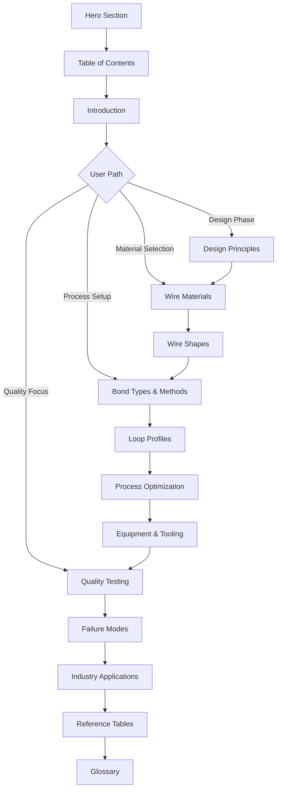

# Wire Bonding Page Expansion Plan

## Executive Summary

This document outlines a comprehensive plan to expand the existing Wire Bonding informational page at `/resources/wire-bonding` based on analysis of 22 PDF documents and 15 new images. The expansion will transform the page from a basic overview into an authoritative technical reference for RF engineers and semiconductor technicians.

---

## 1. Content Analysis Summary

### 1.1 Critical Standards Documents

#### MIL-STD-883K Method 2023.7 - Nondestructive Bond Pull Test
**Key Content:**
- Hook placement specifications: between midspan and loop apex
- Pull force tables for Al and Au wires by diameter (18μm to 76μm)
- Alternative procedures for high pin count devices (≥84 terminals)
- SPC requirements and process capability studies
- Flat loop formula for RF/microwave hybrids: V₁ = V₂ Sin θ
- Failure mode codes 1-8 with descriptions

**Unique Value:** Official military standard test procedures - essential for defense/aerospace applications

#### JEDEC JESD22-B120 - Wire Bond Pull Test Methods
**Key Content:**
- Ball Pull Test (BPT) and Stitch Pull Test (SPT) procedures
- New failure code numbering scheme (1-9 sequential from die to substrate)
- Hook placement guidance for different bond types
- Copper wire bond considerations
- Minimum pull force values for Cu wires (same as Au)

**Unique Value:** Industry-standard test methods for commercial applications

#### IPC-TM-650 Method 2.4.42.3 - Wire Bond Pull Strength
**Key Content:**
- Test conditions A, C, D, F, G, H for different bond configurations
- Pre-seal vs post-seal minimum bond strength requirements
- Flip chip and beam lead test procedures
- Equipment accuracy requirements (±25% or ±0.25 gf)

**Unique Value:** IPC test methods for PCB/substrate applications

### 1.2 Technical Reference Documents

#### Chapter A: Wire Bonding (3201)
**Key Content:**
- Ball bonding vs wedge bonding (93% vs 5% market share)
- Metallurgical systems: Au-Au, Au-Al, Au-Cu, Au-Ag, Al-Al, Al-Ag, Al-Ni, Cu-Al
- Bonding equipment specifications (wedge tools, capillaries)
- Process optimization flowchart
- Design guidelines: ball size 2-3x wire diameter, bond size ≤3/4 pad size
- Cleaning methods: plasma, UV-ozone

**Unique Value:** Comprehensive technical foundation

#### Critical Review of MIL-STD-883 Visual Inspection
**Key Content:**
- Ball squash factor: 2X to 5X wire diameter (optimal <3.5X)
- Crescent bond criteria
- Wedge bond squash: 1.2X to 2X wire diameter (optimal 1.3-1.6X)
- Heel crack inspection at 30-60X magnification
- Probe mark criteria (>25% pad area = reject)

**Unique Value:** Practical visual inspection guidelines

#### Heraeus Bonding Wire Datasheet
**Key Content:**
- Gold wire: 4N (99.99%), 3N (99.9%), 2N (99%) purity levels
- Aluminum wire: Fine (18-100μm) and Heavy (>100μm) categories
- Copper wire: 20-75μm diameter range
- Physical properties tables (melting point, density, conductivity)
- HAZ (Heat Affected Zone) characteristics
- Ribbon dimensions and wire equivalents

**Unique Value:** Detailed wire specifications for material selection

### 1.3 Design & Process Documents

#### Chip Packaging Design Guide (MT-2007-011)
**Key Content:**
- Fan-out angle guidelines (≤45° recommended)
- Pitch limitations for RF signals (100μm minimum for 33μm wire)
- Staggered pad configurations
- PCB cavity design for reduced wire length
- Cost/complexity levels (1-3) for different configurations
- Reverse bonding techniques

**Unique Value:** Practical design rules for chip packaging

#### Wedge Bonding for RF and Optoelectronic Packaging (57419)
**Key Content:**
- 45° vs 90° wire feed configurations
- Ribbon bonding (1x10mil, 0.5x3mil, 0.25x3mil Au ribbons)
- Fixed loop span techniques for RF connections
- Strip line to strip line connections
- Bond placement accuracy (3μm vision, 3-5μm tool position)

**Unique Value:** RF-specific bonding techniques

### 1.4 Testing & Quality Documents

#### Behavior of Aluminum Heavy Wires in Shear Test
**Key Content:**
- DVS-2811 shear code definitions (1-4)
- Al H11 vs AlMg0.5 material behavior
- Shear height specification (30μm = 1/10 wire diameter)
- Hardness distribution mapping
- Work hardening vs softening effects

**Unique Value:** Advanced shear test interpretation

#### EV Wire Bonding Article (Charged EV)
**Key Content:**
- Tesla battery pack wire bonding patent
- Aluminum wire as fusible links
- 60 kHz ultrasonic frequency
- ~100ms bonding time
- PiQC quality monitoring system (5 indices)
- Bondable surfaces list

**Unique Value:** EV/battery application specifics

---

## 2. New Sections to Add

### 2.1 Design Principles & Guidelines (NEW SECTION)

**Purpose:** Provide engineers with pre-bonding design considerations

**Content:**
1. **Pad Layout Guidelines**
   - Pad location rules (avoid die-to-die bonds, crossed wires)
   - Minimum pad dimensions by wire diameter
   - Staggered vs inline pad configurations
   - Fan-out angle limits (≤45°)

2. **Spacing & Clearance Requirements**
   - Wire-to-wire spacing
   - Wire-to-lid clearance (0.020-0.025 in)
   - Bond-to-component spacing
   - Glob-top dam placement

3. **Pitch Limitations**
   - RF signals: 100μm minimum for 33μm wire
   - Data signals: 45-60μm minimum for 17μm wire
   - Staggered pad effective pitch calculations

4. **Design for Manufacturability**
   - Cost/complexity levels
   - Reverse bonding considerations
   - Multi-stitch bond planning

**Images to Include:**
- `FIGURE 3 General guidelines for wire bond pad locations.png`
- `FIGURE 4 bond distance and locations.png`
- `TABLE 2 Typical substrate and IC pad dimensions.png`

### 2.2 Quality Testing Deep Dive (EXPANDED SECTION)

**Purpose:** Comprehensive coverage of all test methods and standards

**Content:**
1. **Pull Testing**
   - MIL-STD-883 Method 2011 (destructive)
   - MIL-STD-883 Method 2023 (nondestructive)
   - JEDEC JESD22-B116/B120
   - IPC-TM-650 Method 2.4.42.3
   - Hook placement specifications
   - Pull force tables by wire diameter

2. **Shear Testing**
   - DVS-2811 standard
   - Shear codes 1-4 definitions
   - Shear height specifications
   - Ball shear vs wedge shear

3. **Failure Mode Classification**
   - 8-point failure location system
   - JEDEC 9-point sequential coding
   - Failure mode interpretation

4. **Statistical Process Control**
   - SPC requirements per MIL-STD-883
   - Process capability studies
   - High pin count device procedures (≥84 terminals)

**Images to Include:**
- `FIGURE 2023-1 Bond pull hook placement location.png`
- `FIGURE 2023-3 Flat loop wire pull testing.png`
- `FIGURE 5 Wire bond failure locations and descriptions.png`
- `Schematic cross-section of a shear test.png`
- `bondtests pull strength vs wire deformation.jpg`

### 2.3 Visual Inspection Criteria (NEW SECTION)

**Purpose:** Detailed AOI and microscopy inspection guidelines

**Content:**
1. **Ball Bond Inspection**
   - Squash factor: 2X-5X wire diameter (optimal <3.5X)
   - Ball placement on pad
   - Ball shape uniformity
   - Intermetallic coverage

2. **Wedge Bond Inspection**
   - Squash factor: 1.2X-2X wire diameter (optimal 1.3-1.6X)
   - Heel crack detection (30-60X magnification)
   - Tail length requirements

3. **Security Bond Inspection**
   - Ball-on-ball coverage (>75% contact area)
   - Ball-on-crescent alignment
   - Ribbon-on-ribbon coverage

4. **Defect Criteria**
   - Probe mark limits (<25% pad area)
   - Wire sweep limits
   - Loop height uniformity

**Images to Include:**
- `wire bond coverage.png`
- `Microscopic image of a partially sheared Al H11 wedge.png`

### 2.4 Process Optimization & Control (NEW SECTION)

**Purpose:** Guide engineers in optimizing bonding parameters

**Content:**
1. **Key Process Parameters**
   - Ultrasonic power
   - Bonding force
   - Time
   - Temperature (for thermosonic)

2. **Parameter Optimization**
   - Pull strength vs wire deformation curve
   - Optimal bonding region identification
   - Lift-off vs breakage regions

3. **Quality Monitoring**
   - Real-time process monitoring
   - PiQC indices (Wedge, Friction, Ultrasonics, Frequency, Wire Deformation)
   - Bond quality value calculation

4. **Surface Preparation**
   - Plasma cleaning
   - UV-ozone cleaning
   - Contamination effects

**Images to Include:**
- `bondtests pull strength vs wire deformation.jpg`

### 2.5 Equipment & Tooling (NEW SECTION)

**Purpose:** Overview of bonding equipment and consumables

**Content:**
1. **Wire Bonder Types**
   - Ball bonders (capillary-based)
   - Wedge bonders
   - Automatic vs manual

2. **Bonding Tools**
   - Capillary specifications
   - Wedge tool geometries (V-groove, flat)
   - Tool wear and replacement

3. **Transducer Systems**
   - Ultrasonic frequency ranges (60-140 kHz)
   - Transducer mounting

4. **Work Stage & Fixturing**
   - Substrate heating
   - Clamping requirements
   - Pattern recognition systems

**Images to Include:**
- `wire bonder staging diagram.jpg`
- `Wire-Bonding-Process.jpg`

### 2.6 Industry Applications (EXPANDED SECTION)

**Purpose:** Application-specific guidance

**Content:**
1. **RF & Microwave**
   - Ribbon bonding for low inductance
   - Fixed loop span techniques
   - Strip line connections
   - Impedance matching considerations

2. **Electric Vehicles**
   - Battery pack connections
   - Fusible link design
   - Heavy wire bonding (up to 500μm)
   - Thermal cycling requirements (-40° to 125°C)

3. **Power Electronics**
   - Heavy aluminum wire
   - Copper wire for high current
   - Multi-stitch bonds
   - Thermal management

4. **LED & Optoelectronics**
   - Fine pitch bonding
   - Gold wire for reliability
   - Low loop profiles

---

## 3. Image Integration Plan

### 3.1 Process & Methods Section
| Image | Section | Purpose |
|-------|---------|---------|
| `FIGURE 2 Schematic sequence of ball-stitch wire bonding.png` | Bond Types | 9-step ball bonding process |
| `Wire-Bonding-Process.jpg` | Methods | Thermosonic process cycle |
| `wire bonder staging diagram.jpg` | Equipment | Ultrasonic system components |

### 3.2 Design Principles Section
| Image | Section | Purpose |
|-------|---------|---------|
| `FIGURE 3 General guidelines for wire bond pad locations.png` | Design Principles | Good vs poor bonding practice |
| `FIGURE 4 bond distance and locations.png` | Design Principles | Spacing calculations |
| `TABLE 2 Typical substrate and IC pad dimensions.png` | Design Principles | Dimension reference table |

### 3.3 Quality Testing Section
| Image | Section | Purpose |
|-------|---------|---------|
| `FIGURE 2023-1 Bond pull hook placement location.png` | Pull Testing | Hook placement diagram |
| `FIGURE 2023-3 Flat loop wire pull testing.png` | Pull Testing | Flat loop test method |
| `FIGURE 5 Wire bond failure locations and descriptions.png` | Failure Modes | 8-point failure system |
| `Schematic cross-section of a shear test.png` | Shear Testing | Shear test stages |
| `bondtests pull strength vs wire deformation.jpg` | Process Optimization | Optimal bonding region |

### 3.4 Visual Inspection Section
| Image | Section | Purpose |
|-------|---------|---------|
| `wire bond coverage.png` | Visual Inspection | Accept/reject criteria |
| `Microscopic image of a partially sheared Al H11 wedge.png` | Shear Testing | Microscopy example |

### 3.5 Comparison Tables
| Image | Section | Purpose |
|-------|---------|---------|
| `TABLE 1 Comparison of wire-bonding methods by bond type.png` | Methods | Method comparison |
| `Table 1 Ball bonding versus wedge bonding summary.png` | Bond Types | Ball vs wedge decision guide |

---

## 4. Page Flow Redesign

### 4.1 Proposed Section Order

```
1. Hero Section (existing - update statistics)
2. Table of Contents (existing - expand)
3. Introduction/Overview (existing - enhance)
4. Design Principles & Guidelines (NEW)
   4.1 Pad Layout Guidelines
   4.2 Spacing & Clearance Requirements
   4.3 Pitch Limitations
   4.4 Design for Manufacturability
5. Wire Materials & Selection (existing - expand with Heraeus data)
   5.1 Gold Wire (4N, 3N, 2N)
   5.2 Aluminum Wire (Fine, Heavy)
   5.3 Copper Wire
   5.4 Palladium-Coated Copper
   5.5 Silver Wire
   5.6 Ribbon Options
6. Wire Shapes (existing)
   6.1 Round Wire
   6.2 Ribbon Wire
7. Bond Types & Methods (existing - reorganize)
   7.1 Ball Bonding (Thermosonic)
   7.2 Wedge Bonding (Ultrasonic, Thermosonic)
   7.3 Security Bonds (Ball-on-Ball, Ball-on-Stitch)
   7.4 Reverse Bonds (SOS/BSOB)
8. Loop Profiles & Trajectories (existing - expand)
   8.1 Basic Loop
   8.2 Reverse Loop
   8.3 Double Reverse Loop
   8.4 Long Loop
   8.5 Flat Loop (RF applications)
9. Process Optimization (NEW)
   9.1 Key Parameters
   9.2 Parameter Optimization
   9.3 Quality Monitoring
   9.4 Surface Preparation
10. Equipment & Tooling (NEW)
    10.1 Wire Bonder Types
    10.2 Bonding Tools
    10.3 Transducer Systems
11. Quality Testing & Acceptance (EXPANDED)
    11.1 Pull Testing (MIL-STD-883, JEDEC, IPC)
    11.2 Shear Testing (DVS-2811)
    11.3 Visual Inspection Criteria
    11.4 Statistical Process Control
12. Failure Modes & Troubleshooting (existing - expand)
    12.1 Heel Cracking
    12.2 Cratering
    12.3 Lift-off/NSOP
    12.4 Kirkendall Voids
    12.5 Wire Sweep
    12.6 Intermetallic Failures
13. Industry Applications (NEW)
    13.1 RF & Microwave
    13.2 Electric Vehicles
    13.3 Power Electronics
    13.4 LED & Optoelectronics
14. Reference Tables & Calculators (NEW)
15. Glossary (existing - expand)
```

### 4.2 Navigation Flow Diagram



---

## 5. Interactive Elements

### 5.1 Pull Test Calculator

**Purpose:** Calculate minimum pull force requirements

**Inputs:**
- Wire material (Au, Al, Cu)
- Wire diameter (μm or mils)
- Test standard (MIL-STD-883, JEDEC, IPC)
- Pre-seal or post-seal

**Outputs:**
- Minimum pull force (gf)
- Recommended test parameters
- Hook placement guidance

**Implementation:**
```javascript
// Example calculation logic
function calculateMinPullForce(material, diameter, standard, preSeal) {
  const tables = {
    'MIL-STD-883': {
      'Au': { 18: { pre: 2.0, post: 1.5 }, 25: { pre: 3.0, post: 2.5 }, ... },
      'Al': { 18: { pre: 1.5, post: 1.0 }, 25: { pre: 2.5, post: 1.5 }, ... }
    }
  };
  return tables[standard][material][diameter][preSeal ? 'pre' : 'post'];
}
```

### 5.2 Wire Selection Guide Wizard

**Purpose:** Help users select appropriate wire material and diameter

**Decision Tree:**
1. Application type (RF, Power, Standard IC)
2. Operating temperature range
3. Pad metallization
4. Cost sensitivity
5. Reliability requirements

**Output:**
- Recommended wire material
- Diameter range
- Bonding method
- Special considerations

### 5.3 Visual Inspection Checklist

**Purpose:** Interactive checklist for bond inspection

**Categories:**
- [ ] Ball bond squash factor (2X-5X)
- [ ] Ball placement on pad
- [ ] Wedge bond squash (1.2X-2X)
- [ ] Heel crack inspection
- [ ] Loop height uniformity
- [ ] Wire sweep check
- [ ] Probe mark assessment

**Features:**
- Pass/fail indicators
- Reference images for each criterion
- Export inspection report

### 5.4 Process Parameter Reference

**Purpose:** Quick reference for bonding parameters

**Features:**
- Filterable by wire type, diameter, substrate
- Parameter ranges (power, force, time, temperature)
- Typical values vs limits
- Troubleshooting tips

### 5.5 Failure Mode Diagnostic Tool

**Purpose:** Help identify root cause of bond failures

**Input:**
- Failure location (1-8 code)
- Visual characteristics
- Process conditions

**Output:**
- Likely root causes
- Corrective actions
- Prevention strategies

---

## 6. Implementation Checklist

### Phase 1: Content & Data Updates

#### 6.1 JSON Data File Updates
- [ ] Update `materials.json` with Heraeus wire specifications
  - Add 4N/3N/2N gold purity levels
  - Add fine vs heavy aluminum categories
  - Add copper wire specifications
  - Add ribbon equivalents
- [ ] Update `bond-types.json` with expanded process details
  - Add thermosonic vs ultrasonic parameters
  - Add security bond variations
- [ ] Update `failure-modes.json` with 8-point failure system
  - Add JEDEC 9-point coding
  - Add root cause analysis
- [ ] Create `test-standards.json` for pull/shear test data
  - MIL-STD-883 Method 2023 tables
  - JEDEC JESD22-B120 requirements
  - IPC-TM-650 specifications
- [ ] Create `design-guidelines.json` for design rules
  - Pad dimensions by wire diameter
  - Spacing requirements
  - Pitch limitations

#### 6.2 Image Assets
- [ ] Copy all 15 new images to `public/images/wire-bonding/`
- [ ] Optimize images for web (compress, resize)
- [ ] Create image metadata file for captions/alt text
- [ ] Verify image licensing/attribution requirements

### Phase 2: New Vue Components

#### 6.3 Section Components
- [ ] Create `WBDesignPrinciplesSection.vue`
  - Pad layout guidelines subsection
  - Spacing requirements subsection
  - Pitch limitations subsection
  - Interactive design rule checker
- [ ] Create `WBQualityTestingSection.vue`
  - Pull testing subsection with standards tabs
  - Shear testing subsection
  - Failure mode classification
  - SPC requirements
- [ ] Create `WBVisualInspectionSection.vue`
  - Ball bond criteria
  - Wedge bond criteria
  - Security bond criteria
  - Interactive checklist
- [ ] Create `WBProcessOptimizationSection.vue`
  - Parameter optimization guide
  - Quality monitoring overview
  - Surface preparation guidelines
- [ ] Create `WBEquipmentSection.vue`
  - Bonder types overview
  - Tool specifications
  - System components
- [ ] Create `WBApplicationsSection.vue`
  - RF/Microwave tab
  - EV/Battery tab
  - Power Electronics tab
  - LED/Optoelectronics tab

#### 6.4 Interactive Components
- [ ] Create `PullTestCalculator.vue`
  - Input form for parameters
  - Calculation logic
  - Results display with recommendations
- [ ] Create `WireSelectionWizard.vue`
  - Multi-step decision tree
  - Recommendation engine
  - Comparison output
- [ ] Create `InspectionChecklist.vue`
  - Interactive checklist items
  - Pass/fail indicators
  - Export functionality
- [ ] Create `ProcessParameterReference.vue`
  - Filterable data table
  - Parameter ranges display
  - Troubleshooting tips
- [ ] Create `FailureDiagnosticTool.vue`
  - Failure code input
  - Root cause analysis
  - Corrective action recommendations

### Phase 3: Component Updates

#### 6.5 Existing Component Enhancements
- [ ] Update `WBHeroSection.vue`
  - Add new statistics from analyzed documents
  - Update key facts
- [ ] Update `WBMaterialsSection.vue`
  - Add Heraeus wire data
  - Add purity level details
  - Add ribbon options
- [ ] Update `WBMethodsSection.vue`
  - Add thermosonic vs ultrasonic comparison
  - Add process parameter details
- [ ] Update `WBBondTypesSection.vue`
  - Add security bond details
  - Add reverse bond techniques
- [ ] Update `WBLoopProfilesSection.vue`
  - Add flat loop for RF applications
  - Add trajectory details
- [ ] Update `WBReliabilitySection.vue`
  - Expand failure modes
  - Add troubleshooting guides
- [ ] Update `WBTableOfContents.vue`
  - Add new sections
  - Update navigation

### Phase 4: Composables & Utilities

#### 6.6 New Composables
- [ ] Create `usePullTestCalculator.js`
  - Pull force calculation logic
  - Standard-specific tables
- [ ] Create `useWireSelection.js`
  - Decision tree logic
  - Recommendation algorithm
- [ ] Create `useInspectionCriteria.js`
  - Inspection rules
  - Pass/fail logic
- [ ] Create `useFailureDiagnostics.js`
  - Failure code mapping
  - Root cause database

#### 6.7 Update Existing Composables
- [ ] Update `useWireBondingData.js`
  - Add new data file loading
  - Add computed properties for new sections

### Phase 5: Styling & Polish

#### 6.8 CSS Updates
- [ ] Add styles for new interactive components
- [ ] Ensure responsive design for calculators
- [ ] Add print styles for inspection checklist
- [ ] Verify accessibility compliance

### Phase 6: Testing & Documentation

#### 6.9 Testing
- [ ] Unit tests for calculator logic
- [ ] Component tests for new sections
- [ ] Integration tests for data loading
- [ ] Cross-browser testing
- [ ] Mobile responsiveness testing

#### 6.10 Documentation
- [ ] Update component documentation
- [ ] Add JSDoc comments to composables
- [ ] Create user guide for interactive tools
- [ ] Document data file schemas

---

## 7. Data Schema Updates

### 7.1 New `test-standards.json` Schema

```json
{
  "standards": [
    {
      "id": "mil-std-883-2023",
      "name": "MIL-STD-883 Method 2023",
      "type": "nondestructive",
      "description": "Nondestructive bond pull test",
      "pullForceTable": {
        "Au": {
          "18": { "preSeal": 2.0, "postSeal": 1.5 },
          "25": { "preSeal": 3.0, "postSeal": 2.5 }
        },
        "Al": {
          "18": { "preSeal": 1.5, "postSeal": 1.0 },
          "25": { "preSeal": 2.5, "postSeal": 1.5 }
        }
      },
      "hookPlacement": "Between midspan and loop apex",
      "failureCodes": [
        { "code": 1, "location": "Wire break at neckdown" },
        { "code": 2, "location": "Wire break other than neckdown" }
      ]
    }
  ]
}
```

### 7.2 New `design-guidelines.json` Schema

```json
{
  "padDimensions": {
    "ball": {
      "25um": { "minDiameter": "0.003 in", "recommended": "0.004 in" },
      "18um": { "minDiameter": "0.002 in", "recommended": "0.003 in" }
    },
    "wedge": {
      "25um": { "minWidth": "0.0025 in", "recommended": "0.003 in" }
    }
  },
  "spacing": {
    "wireToWire": "2.5x wire diameter minimum",
    "wireToLid": "0.020-0.025 in",
    "bondToComponent": "0.025 in minimum"
  },
  "pitchLimitations": {
    "rf": {
      "33um": { "straight": "100μm", "staggered": "50μm" }
    },
    "data": {
      "17um": { "straight": "45-50μm", "staggered": "30μm" }
    }
  }
}
```

---

## 8. Success Metrics

### 8.1 Content Completeness
- [ ] All 6 new sections implemented
- [ ] All 15 images integrated
- [ ] All 4 interactive tools functional
- [ ] All test standards documented

### 8.2 User Experience
- [ ] Page load time < 3 seconds
- [ ] All interactive tools responsive
- [ ] Mobile-friendly layout
- [ ] Accessible (WCAG 2.1 AA)

### 8.3 Technical Quality
- [ ] No console errors
- [ ] All unit tests passing
- [ ] Code coverage > 80%
- [ ] Lighthouse score > 90

---

## 9. Dependencies & Prerequisites

### 9.1 Required Before Implementation
- Existing wire bonding page components functional
- Shared components (TabContainer, AccordionPanel, etc.) available
- Image optimization pipeline configured
- JSON data loading infrastructure in place

### 9.2 External Dependencies
- None required - all content is self-contained

---

## 10. Risk Assessment

| Risk | Impact | Mitigation |
|------|--------|------------|
| Image licensing issues | Medium | Verify all images are from public domain or properly licensed |
| Calculator accuracy | High | Validate against official standards documents |
| Content overload | Medium | Implement progressive disclosure, collapsible sections |
| Performance impact | Medium | Lazy load images, code split new sections |
| Mobile usability | Medium | Test interactive tools on mobile devices |

---

## Appendix A: Document Analysis Details

### PDF Documents Analyzed

| Document | Pages | Key Topics | Priority |
|----------|-------|------------|----------|
| MIL-STD-883K Method 2023.7 | 12 | Pull test procedures | Critical |
| Chapter A Wire Bonding (3201) | 40+ | Comprehensive overview | High |
| Critical Review MIL-STD-883 Visual | 15 | Inspection criteria | High |
| JEDEC Wire Bond Pull Test (68248) | 8 | JESD22-B120 standard | High |
| Heraeus Bonding Wire Datasheet | 24 | Wire specifications | High |
| Chip Packaging Design Guide | 20 | Design rules | High |
| Wedge Bonding RF/Optoelectronic | 10 | RF applications | Medium |
| IPC-TM-650 Method 2.4.42.3 | 3 | IPC test methods | Medium |
| Shear Test Behavior Paper | 8 | DVS-2811 shear codes | Medium |
| EV Wire Bonding Article | 8 | Battery applications | Medium |

### Image Assets Cataloged

| Image | Size | Section Target | Priority |
|-------|------|----------------|----------|
| Ball-stitch sequence | 133 KB | Bond Types | High |
| Hook placement | 21 KB | Quality Testing | Critical |
| Pad location guidelines | 67 KB | Design Principles | Critical |
| Bond distances | 74 KB | Design Principles | High |
| Failure locations | 66 KB | Failure Modes | Critical |
| Methods comparison table | 46 KB | Methods | High |
| Pad dimensions table | 71 KB | Design Principles | High |
| Ball vs wedge summary | 120 KB | Bond Types | High |
| Shear test schematic | 169 KB | Quality Testing | High |
| Flat loop testing | 20 KB | Quality Testing | Medium |
| Pull strength graph | 104 KB | Process Optimization | High |
| Bond coverage | 571 KB | Visual Inspection | Critical |
| Bonder staging | 89 KB | Equipment | Medium |
| Sheared wedge microscopy | 1063 KB | Quality Testing | Medium |
| Wire bonding process | 114 KB | Methods | High |

---

*Document Version: 1.0*
*Created: 2026-02-01*
*Author: Architect Mode Analysis*
