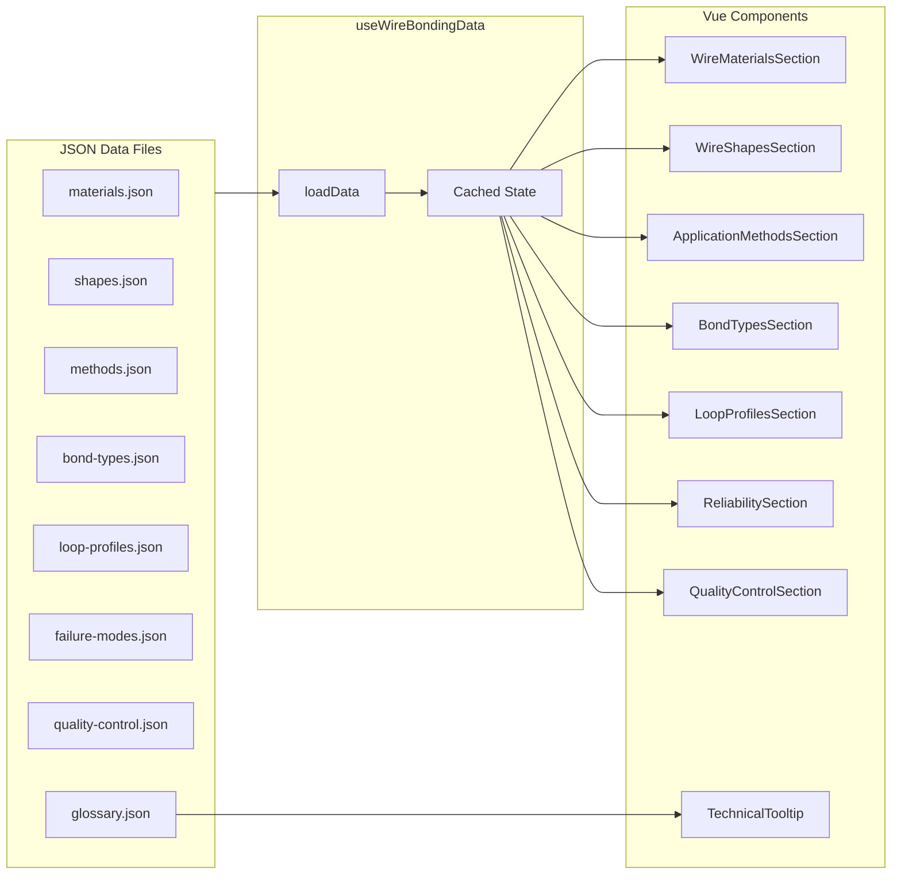

# Wire Bonding Informational Page - Architecture Specification

## 1. Overview

This specification defines a comprehensive, single-page Wire Bonding informational resource for RF engineers and semiconductor technicians. The page will be integrated into the existing Vue.js application at `/home/d/Dev_Test/kil_code`.

### 1.1 Design Goals
- **Single-page design** with smooth scrolling navigation
- **Technically deep content** suitable for RF engineers and semiconductor professionals
- **Interactive elements** for enhanced learning and reference
- **Consistent styling** with existing mil-specs.com design system
- **Responsive layout** for desktop and mobile viewing

### 1.2 Target Audience
- RF Engineers
- Semiconductor Technicians
- Quality Assurance Engineers
- Process Engineers working with wire bonding

---

## 2. Page Structure & Content Outline

### 2.1 Section Architecture

```
┌─────────────────────────────────────────────────────────────────┐
│                         HERO SECTION                            │
│  Title: Wire Bonding Technology Guide                           │
│  Subtitle: Comprehensive reference for semiconductor            │
│           interconnect technology                               │
└─────────────────────────────────────────────────────────────────┘
                              │
┌─────────────────────────────┴───────────────────────────────────┐
│                    STICKY TABLE OF CONTENTS                     │
│  [Overview] [Materials] [Shapes] [Methods] [Bond Types]         │
│  [Loop Profiles] [Reliability] [Quality Control]                │
└─────────────────────────────────────────────────────────────────┘
                              │
┌─────────────────────────────┴───────────────────────────────────┐
│ SECTION 1: Executive Overview                                   │
│ - Quick reference cards (collapsible)                           │
│ - Key statistics (75% market share, wire sizes, etc.)           │
└─────────────────────────────────────────────────────────────────┘
                              │
┌─────────────────────────────┴───────────────────────────────────┐
│ SECTION 2: Wire Materials                                       │
│ - Tabbed interface: Au | Al | Cu | Pd-Cu | Ag                   │
│ - Comparison table with sorting/filtering                       │
│ - Technical tooltips for terms                                  │
└─────────────────────────────────────────────────────────────────┘
                              │
┌─────────────────────────────┴───────────────────────────────────┐
│ SECTION 3: Wire Shapes                                          │
│ - Round Wire vs Ribbon comparison                               │
│ - RF/Microwave application focus                                │
│ - Skin effect explanation with tooltips                         │
└─────────────────────────────────────────────────────────────────┘
                              │
┌─────────────────────────────┴───────────────────────────────────┐
│ SECTION 4: Application Methods                                  │
│ - Comparison table: Thermocompression | Ultrasonic | Thermosonic│
│ - Frequency deep-dive accordion                                 │
└─────────────────────────────────────────────────────────────────┘
                              │
┌─────────────────────────────┴───────────────────────────────────┐
│ SECTION 5: Bond Types                                           │
│ - Tabbed interface: Ball | Wedge | Security | SOS/BSOB          │
│ - Process step diagrams                                         │
│ - Expandable detailed content                                   │
└─────────────────────────────────────────────────────────────────┘
                              │
┌─────────────────────────────┴───────────────────────────────────┐
│ SECTION 6: Loop Profiles & Trajectories                         │
│ - Interactive image viewer with 4 loop types                    │
│ - Schematic + real photo comparison                             │
│ - Technical specifications for each                             │
└─────────────────────────────────────────────────────────────────┘
                              │
┌─────────────────────────────┴───────────────────────────────────┐
│ SECTION 7: Reliability & Failure Modes                          │
│ - Accordion sections for each failure type                      │
│ - Root cause analysis                                           │
│ - Prevention strategies                                         │
└─────────────────────────────────────────────────────────────────┘
                              │
┌─────────────────────────────┴───────────────────────────────────┐
│ SECTION 8: Quality & Process Controls                           │
│ - MIL-STD-883 reference integration                             │
│ - Test method cards                                             │
│ - Real-time monitoring explanation                              │
└─────────────────────────────────────────────────────────────────┘
```

### 2.2 Section IDs for Navigation

| Section | ID | Title |
|---------|-----|-------|
| Hero | `hero` | Wire Bonding Technology Guide |
| Overview | `overview` | Executive Overview |
| Materials | `materials` | Wire Materials |
| Shapes | `shapes` | Wire Shapes |
| Methods | `methods` | Application Methods |
| Bond Types | `bond-types` | Bond Types & Process Mechanics |
| Loop Profiles | `loop-profiles` | Loop Profiles & Trajectories |
| Reliability | `reliability` | Reliability & Failure Modes |
| Quality | `quality-control` | Quality & Process Controls |

---

## 3. Component Architecture

### 3.1 Component Hierarchy

```
WireBondingView.vue (Main Page)
├── WireBondingHero.vue
├── WireBondingTableOfContents.vue (Sticky)
├── WireBondingOverview.vue
│   └── QuickReferenceCard.vue (×3)
├── WireMaterialsSection.vue
│   ├── MaterialTabs.vue
│   └── MaterialComparisonTable.vue
├── WireShapesSection.vue
│   └── ShapeComparisonCard.vue (×2)
├── ApplicationMethodsSection.vue
│   ├── MethodComparisonTable.vue
│   └── AccordionPanel.vue
├── BondTypesSection.vue
│   ├── BondTypeTabs.vue
│   └── ProcessStepDiagram.vue
├── LoopProfilesSection.vue
│   └── LoopProfileViewer.vue
├── ReliabilitySection.vue
│   └── FailureModeAccordion.vue (×4)
└── QualityControlSection.vue
    ├── TestMethodCard.vue (×3)
    └── MonitoringExplainer.vue
```

### 3.2 Shared/Reusable Components

```
src/components/wire-bonding/
├── shared/
│   ├── TechnicalTooltip.vue
│   ├── AccordionPanel.vue
│   ├── TabContainer.vue
│   ├── ComparisonTable.vue
│   ├── QuickReferenceCard.vue
│   └── ImageViewer.vue
├── sections/
│   ├── WireBondingHero.vue
│   ├── WireBondingTableOfContents.vue
│   ├── WireBondingOverview.vue
│   ├── WireMaterialsSection.vue
│   ├── WireShapesSection.vue
│   ├── ApplicationMethodsSection.vue
│   ├── BondTypesSection.vue
│   ├── LoopProfilesSection.vue
│   ├── ReliabilitySection.vue
│   └── QualityControlSection.vue
└── index.js (barrel export)
```

---

## 4. Component Specifications

### 4.1 WireBondingView.vue (Main Page Component)

**Purpose:** Main container component that orchestrates all sections and manages scroll-spy state.

**Template Structure:**
```vue
<template>
  <div class="wire-bonding-view">
    <WireBondingHero />
    <WireBondingTableOfContents 
      :sections="sections" 
      :active-section="activeSection"
      @navigate="scrollToSection"
    />
    <main class="wire-bonding-content">
      <WireBondingOverview id="overview" ref="overviewRef" />
      <WireMaterialsSection id="materials" ref="materialsRef" />
      <WireShapesSection id="shapes" ref="shapesRef" />
      <ApplicationMethodsSection id="methods" ref="methodsRef" />
      <BondTypesSection id="bond-types" ref="bondTypesRef" />
      <LoopProfilesSection id="loop-profiles" ref="loopProfilesRef" />
      <ReliabilitySection id="reliability" ref="reliabilityRef" />
      <QualityControlSection id="quality-control" ref="qualityRef" />
    </main>
  </div>
</template>
```

**Props:** None

**Emits:** None

**Composables Used:**
- `useScrollSpy()` - Custom composable for tracking active section
- `useSmoothScroll()` - Custom composable for smooth navigation

---

### 4.2 WireBondingTableOfContents.vue

**Purpose:** Sticky navigation that highlights current section and enables smooth scrolling.

**Props:**
```typescript
interface Props {
  sections: Array<{
    id: string
    title: string
    icon?: string
  }>
  activeSection: string
}
```

**Emits:**
```typescript
interface Emits {
  (e: 'navigate', sectionId: string): void
}
```

**Behavior:**
- Sticks to top of viewport after scrolling past hero
- Highlights active section based on scroll position
- Collapses to hamburger menu on mobile (<768px)
- Smooth scroll animation on click (duration: 600ms)

**CSS Classes:**
- `.toc-container` - Main wrapper
- `.toc-sticky` - Applied when sticky
- `.toc-item` - Individual nav item
- `.toc-item--active` - Active state
- `.toc-mobile-toggle` - Mobile hamburger button

---

### 4.3 TechnicalTooltip.vue

**Purpose:** Displays technical term definitions on hover/focus.

**Props:**
```typescript
interface Props {
  term: string           // The term being defined
  definition: string     // Full definition text
  placement?: 'top' | 'bottom' | 'left' | 'right'  // Default: 'top'
  maxWidth?: string      // Default: '300px'
}
```

**Slots:**
- `default` - The trigger content (usually the term text)

**Behavior:**
- Shows on hover (desktop) or tap (mobile)
- 200ms delay before showing
- 150ms delay before hiding
- Keyboard accessible (shows on focus)
- Auto-repositions to stay in viewport

**Example Usage:**
```vue
<TechnicalTooltip 
  term="HAZ" 
  definition="Heat-Affected Zone - The region of wire adjacent to the ball bond that experiences thermal softening during the EFO process."
>
  <span class="term-highlight">HAZ</span>
</TechnicalTooltip>
```

---

### 4.4 TabContainer.vue

**Purpose:** Reusable tabbed interface for comparing related content.

**Props:**
```typescript
interface Props {
  tabs: Array<{
    id: string
    label: string
    icon?: string
    badge?: string | number
  }>
  defaultTab?: string    // ID of initially active tab
  variant?: 'default' | 'pills' | 'underline'  // Default: 'default'
}
```

**Emits:**
```typescript
interface Emits {
  (e: 'tab-change', tabId: string): void
}
```

**Slots:**
- Named slots matching tab IDs for content

**Example Usage:**
```vue
<TabContainer 
  :tabs="materialTabs" 
  default-tab="gold"
  variant="pills"
>
  <template #gold>
    <GoldWireContent />
  </template>
  <template #aluminum>
    <AluminumWireContent />
  </template>
  <!-- ... -->
</TabContainer>
```

---

### 4.5 AccordionPanel.vue

**Purpose:** Expandable/collapsible content sections.

**Props:**
```typescript
interface Props {
  title: string
  subtitle?: string
  icon?: string
  defaultOpen?: boolean   // Default: false
  variant?: 'default' | 'bordered' | 'filled'  // Default: 'default'
}
```

**Emits:**
```typescript
interface Emits {
  (e: 'toggle', isOpen: boolean): void
}
```

**Slots:**
- `default` - Main content
- `header` - Custom header content (optional)

**Behavior:**
- Smooth height animation (300ms ease-out)
- Rotate chevron icon on expand
- Keyboard accessible (Enter/Space to toggle)
- ARIA attributes for accessibility

---

### 4.6 ComparisonTable.vue

**Purpose:** Sortable, filterable comparison table for technical data.

**Props:**
```typescript
interface Props {
  columns: Array<{
    key: string
    label: string
    sortable?: boolean
    filterable?: boolean
    width?: string
    align?: 'left' | 'center' | 'right'
    formatter?: (value: any) => string
  }>
  data: Array<Record<string, any>>
  defaultSort?: { key: string, direction: 'asc' | 'desc' }
  striped?: boolean       // Default: true
  hoverable?: boolean     // Default: true
  compact?: boolean       // Default: false
}
```

**Emits:**
```typescript
interface Emits {
  (e: 'sort', payload: { key: string, direction: 'asc' | 'desc' }): void
  (e: 'filter', payload: { key: string, value: string }): void
  (e: 'row-click', row: Record<string, any>): void
}
```

**Features:**
- Click column header to sort
- Filter input in column header (when filterable)
- Responsive: horizontal scroll on mobile
- Highlight row on hover

---

### 4.7 LoopProfileViewer.vue

**Purpose:** Interactive image viewer for the four loop profile types.

**Props:**
```typescript
interface Props {
  profiles: Array<{
    id: string
    name: string
    schematicImage: string
    realImage: string
    description: string
    specifications: {
      loopHeight?: string
      wireLength?: string
      applications?: string[]
      advantages?: string[]
      disadvantages?: string[]
    }
  }>
  defaultProfile?: string
}
```

**Emits:**
```typescript
interface Emits {
  (e: 'profile-change', profileId: string): void
}
```

**Behavior:**
- Thumbnail strip for profile selection
- Large image display area with toggle between schematic/real photo
- Animated transition between profiles (fade + slide)
- Zoom on click/pinch for detailed viewing
- Keyboard navigation (arrow keys)

**Layout:**
```
┌─────────────────────────────────────────────────────────────┐
│  [Basic] [Reverse] [Double Reverse] [Long Loop]  ← Tabs    │
├─────────────────────────────────────────────────────────────┤
│  ┌─────────────────────┐  ┌─────────────────────────────┐  │
│  │                     │  │ Profile Name                │  │
│  │   Main Image        │  │ ─────────────────────────── │  │
│  │   (Schematic/Real)  │  │ Description text here...   │  │
│  │                     │  │                             │  │
│  │   [Toggle View]     │  │ Specifications:             │  │
│  │                     │  │ • Loop Height: X            │  │
│  └─────────────────────┘  │ • Applications: ...         │  │
│                           └─────────────────────────────┘  │
└─────────────────────────────────────────────────────────────┘
```

---

### 4.8 QuickReferenceCard.vue

**Purpose:** Collapsible summary cards for quick reference information.

**Props:**
```typescript
interface Props {
  title: string
  icon?: string
  color?: 'primary' | 'accent' | 'success' | 'warning' | 'info'
  defaultCollapsed?: boolean
  items: Array<{
    label: string
    value: string | number
    unit?: string
    tooltip?: string
  }>
}
```

**Emits:**
```typescript
interface Emits {
  (e: 'toggle', isCollapsed: boolean): void
}
```

---

### 4.9 ImageViewer.vue

**Purpose:** Modal image viewer with zoom and pan capabilities.

**Props:**
```typescript
interface Props {
  src: string
  alt: string
  caption?: string
  zoomable?: boolean      // Default: true
  maxZoom?: number        // Default: 3
}
```

**Emits:**
```typescript
interface Emits {
  (e: 'close'): void
  (e: 'zoom-change', level: number): void
}
```

**Features:**
- Click to open modal
- Pinch/scroll to zoom
- Pan when zoomed
- Close on Escape or click outside
- Touch-friendly controls

---

## 5. Data Structure Specification

### 5.1 Wire Materials Data

**File:** `public/data/wire-bonding/materials.json`

```json
{
  "materials": [
    {
      "id": "gold",
      "name": "Gold (Au)",
      "symbol": "Au",
      "purity": "99.99% (4N)",
      "dopants": ["Beryllium (5-10 ppm)", "Calcium (5-10 ppm)"],
      "properties": {
        "hardness": "Low",
        "oxidationResistance": "Excellent",
        "electricalConductivity": "Excellent",
        "thermalConductivity": "Good",
        "cost": "Very High"
      },
      "pros": [
        "Highly oxidation-resistant (no shielding gas needed)",
        "Soft (low hardness prevents cratering)",
        "Excellent electrical conductivity"
      ],
      "cons": [
        "Extremely expensive",
        "Forms brittle intermetallics with Al pads (Purple Plague, White Plague)"
      ],
      "applications": ["Fine pitch (<60µm)", "High reliability", "Hermetic packages"],
      "bondingMethods": ["Thermosonic Ball Bonding"],
      "technicalNotes": "For ultra-fine pitch applications (<60µm), higher strength gold wire is required. This is achieved by increasing dopants, but increases electrical resistivity."
    },
    {
      "id": "aluminum",
      "name": "Aluminum (Al)",
      "symbol": "Al",
      "alloys": ["Al-1%Si", "Al-0.5%Mg"],
      "properties": {
        "hardness": "Medium",
        "oxidationResistance": "Poor (instant oxidation)",
        "electricalConductivity": "Good",
        "thermalConductivity": "Good",
        "cost": "Low"
      },
      "pros": [
        "Inexpensive",
        "Monometallic bond eliminates intermetallic corrosion",
        "Ideal for hermetic packages"
      ],
      "cons": [
        "Prone to fatigue failure",
        "Requires precise ultrasonic control",
        "Cannot form spherical ball easily"
      ],
      "applications": ["Power devices", "Heavy wire bonding", "Hermetic packages"],
      "bondingMethods": ["Ultrasonic Wedge Bonding"],
      "technicalNotes": "Pure aluminum is too soft to draw effectively; it is almost always alloyed."
    },
    {
      "id": "copper",
      "name": "Copper (Cu)",
      "symbol": "Cu",
      "purity": "99.99%",
      "properties": {
        "hardness": "High",
        "oxidationResistance": "Poor",
        "electricalConductivity": "Excellent",
        "thermalConductivity": "Excellent",
        "cost": "Low (~90% cheaper than Au)"
      },
      "pros": [
        "Cost-effective (90% cheaper than gold)",
        "Better electrical conductivity than Au",
        "Better thermal conductivity than Au"
      ],
      "cons": [
        "Higher risk of cratering (hard wire)",
        "Oxidizes rapidly (requires forming gas)",
        "Requires 20-30% more ultrasonic power"
      ],
      "applications": ["High volume production", "Cost-sensitive applications"],
      "bondingMethods": ["Thermosonic Ball Bonding"],
      "requirements": {
        "formingGas": "95% N₂ / 5% H₂",
        "environment": "Oxygen-free during EFO"
      },
      "technicalNotes": "Modern industry standard replacing gold. Requires forming gas flow during Electronic Flame Off (EFO) process."
    },
    {
      "id": "palladium-copper",
      "name": "Palladium-Coated Copper (Pd-Cu)",
      "symbol": "Pd-Cu",
      "structure": "Copper core with palladium coating",
      "properties": {
        "hardness": "High (slightly harder than bare Cu)",
        "oxidationResistance": "Good (Pd coating)",
        "electricalConductivity": "Excellent",
        "thermalConductivity": "Excellent",
        "cost": "Medium"
      },
      "pros": [
        "Copper core provides conductivity/cost benefits",
        "Palladium coating prevents oxidation",
        "Wider second bond process window"
      ],
      "cons": [
        "Slightly harder than bare Cu",
        "Requires robust pad metallization"
      ],
      "applications": ["High volume with improved process window"],
      "bondingMethods": ["Thermosonic Ball Bonding"],
      "technicalNotes": "Hybrid solution - Pd layer prevents copper from oxidizing before stitch bond is made."
    },
    {
      "id": "silver",
      "name": "Silver (Ag)",
      "symbol": "Ag",
      "properties": {
        "hardness": "Medium",
        "oxidationResistance": "Moderate",
        "electricalConductivity": "Highest",
        "thermalConductivity": "Highest",
        "cost": "Medium",
        "reflectivity": "Highest"
      },
      "pros": [
        "High reflectivity (doesn't absorb light)",
        "Highest electrical conductivity",
        "Highest thermal conductivity"
      ],
      "cons": [
        "Susceptible to electromigration",
        "Dendritic growth in high-humidity environments"
      ],
      "applications": ["LED applications"],
      "bondingMethods": ["Thermosonic Ball Bonding"],
      "technicalNotes": "Niche application primarily for LEDs due to high reflectivity."
    }
  ]
}
```

### 5.2 Wire Shapes Data

**File:** `public/data/wire-bonding/shapes.json`

```json
{
  "shapes": [
    {
      "id": "round",
      "name": "Round Wire",
      "crossSection": "Circular",
      "marketShare": "99%",
      "sizes": {
        "signal": "15µm to 75µm",
        "power": "up to 500µm"
      },
      "characteristics": {
        "skinEffect": "Higher resistance at >10 GHz",
        "inductance": "Standard",
        "heatDissipation": "Standard"
      },
      "applications": ["General IC bonding", "Signal connections", "Power connections"],
      "limitations": ["Skin effect increases impedance at high frequencies"]
    },
    {
      "id": "ribbon",
      "name": "Ribbon Wire",
      "crossSection": "Rectangular (flat)",
      "applications": ["RF devices", "Microwave devices", "GaAs chips", "GaN chips"],
      "characteristics": {
        "skinEffect": "Reduced losses at high frequency due to large surface area",
        "inductance": "Significantly lower than round wire",
        "heatDissipation": "Better due to larger contact area"
      },
      "advantages": [
        "Huge surface area reduces skin effect losses",
        "Significantly lower inductance",
        "Better heat dissipation",
        "Stronger heel (stress distributed across width)"
      ],
      "technicalNotes": "Creates stronger heel because stress is distributed across the width of the ribbon, reducing fatigue failures."
    }
  ]
}
```

### 5.3 Application Methods Data

**File:** `public/data/wire-bonding/methods.json`

```json
{
  "methods": [
    {
      "id": "thermocompression",
      "name": "Thermocompression",
      "energySources": ["Heat", "Pressure"],
      "wireTypes": ["Gold"],
      "temperature": ">300°C",
      "era": "1950s technology",
      "status": "Rare today",
      "characteristics": {
        "speed": "Very slow",
        "heatDamage": "High risk to sensitive dies"
      },
      "pros": ["Simple process"],
      "cons": ["Very slow", "High heat damages modern sensitive dies"]
    },
    {
      "id": "ultrasonic",
      "name": "Ultrasonic",
      "energySources": ["Ultrasonic Vibration", "Pressure"],
      "wireTypes": ["Aluminum"],
      "temperature": "Room temperature",
      "characteristics": {
        "speed": "Moderate",
        "heatDamage": "None (room temperature)"
      },
      "pros": ["Room temperature process", "No oxidation issues", "No heat damage"],
      "cons": ["Limited to aluminum wire"],
      "applications": ["Power devices", "Heavy Al wire"]
    },
    {
      "id": "thermosonic",
      "name": "Thermosonic",
      "energySources": ["Heat", "Pressure", "Ultrasonic"],
      "wireTypes": ["Gold", "Copper", "Silver"],
      "temperature": "100-220°C",
      "frequency": {
        "standard": "60 kHz",
        "highFrequency": "100-140 kHz"
      },
      "status": "Industry Standard",
      "characteristics": {
        "speed": "Fast",
        "heatDamage": "Moderate (controlled)"
      },
      "pros": [
        "Industry standard",
        "Works with multiple wire types",
        "Good balance of speed and quality"
      ],
      "frequencyDetails": {
        "60kHz": {
          "description": "Standard frequency",
          "application": "General bonding"
        },
        "100-140kHz": {
          "description": "High Frequency bonding",
          "benefits": [
            "Lower temperatures (down to 100°C)",
            "Faster bonding times",
            "More efficient scrubbing friction"
          ]
        }
      }
    }
  ]
}
```

### 5.4 Bond Types Data

**File:** `public/data/wire-bonding/bond-types.json`

```json
{
  "bondTypes": [
    {
      "id": "ball",
      "name": "Ball Bonding",
      "nickname": "The Speed King",
      "marketShare": ">90% of ICs",
      "direction": "Omni-directional",
      "applications": ["CPUs", "Memory", "Microcontrollers"],
      "process": [
        {
          "step": 1,
          "name": "EFO (Electronic Flame Off)",
          "description": "High-voltage spark melts wire tip inside ceramic capillary, forming Free Air Ball (FAB)"
        },
        {
          "step": 2,
          "name": "First Bond (Ball Bond)",
          "description": "Capillary descends to die pad. Heat + Ultrasonic Scrub welds ball to pad"
        },
        {
          "step": 3,
          "name": "Looping",
          "description": "Capillary rises to Kink Height, moves in Reverse Motion to bend wire, then moves to second pad"
        },
        {
          "step": 4,
          "name": "Second Bond (Stitch Bond)",
          "description": "Capillary crushes wire against leadframe using outer radius of capillary tip (wedge-shaped bond)"
        },
        {
          "step": 5,
          "name": "Tail Break",
          "description": "Wire clamps close, capillary rises, tearing wire at the Heel of the stitch"
        }
      ],
      "advantages": ["Fast", "Omni-directional", "High throughput"],
      "disadvantages": ["Ball takes up space (limits pitch)"]
    },
    {
      "id": "wedge",
      "name": "Wedge Bonding",
      "nickname": "The Fine Pitch Specialist",
      "wireTypes": ["Aluminum", "Ribbon"],
      "direction": "Uni-directional (tool must rotate)",
      "process": [
        {
          "step": 1,
          "name": "Wire Feed",
          "description": "Wire is fed under wedge tool (no ball formation)"
        },
        {
          "step": 2,
          "name": "First Bond",
          "description": "Tool crushes side of wire onto pad using ultrasonic energy"
        },
        {
          "step": 3,
          "name": "Loop",
          "description": "Tool moves to second pad"
        },
        {
          "step": 4,
          "name": "Second Bond",
          "description": "Another wedge crush"
        }
      ],
      "advantages": ["Finer pitch than ball bonding", "No large ball taking up space"],
      "disadvantages": ["Uni-directional (slower)", "Tool must rotate"]
    },
    {
      "id": "security",
      "name": "Security Bonds / Safety Bumps",
      "purpose": "Reinforce weak stitch bonds",
      "problem": "Stitch bond (2nd bond) is weakest link - often lifts off",
      "solution": "Place ball bond on top of stitch bond after loop is finished",
      "effect": "Anchors the stitch down"
    },
    {
      "id": "sos-bsob",
      "name": "Standoff Stitch (SOS) / Ball Stitch on Ball (BSOB)",
      "technique": "Reverse Bonding",
      "process": [
        {
          "step": 1,
          "description": "Place gold bump on die pad"
        },
        {
          "step": 2,
          "description": "Create loop from leadframe back to die"
        },
        {
          "step": 3,
          "description": "Stitch wire onto top of gold bump"
        }
      ],
      "purpose": "Low-profile packages",
      "advantages": [
        "Extremely flat loop profile",
        "Bump protects die from heavy stitch force"
      ],
      "notes": "Standard forward bonding has high loop arc; reverse bonding allows extremely flat loops"
    }
  ]
}
```

### 5.5 Loop Profiles Data

**File:** `public/data/wire-bonding/loop-profiles.json`

```json
{
  "loopProfiles": [
    {
      "id": "basic",
      "name": "Basic Loop",
      "images": {
        "schematic": "/images/wire-bonding/basic-loop-schematic.jpg",
        "real": "/images/wire-bonding/basic-loop-real.jpg"
      },
      "trajectory": "Up → Move toward 2nd bond → Down",
      "characteristics": {
        "speed": "Fast",
        "stability": "Low (prone to swaying)",
        "complexity": "Simple"
      },
      "pros": ["Simple", "Fast"],
      "cons": ["Prone to swaying"],
      "applications": ["Short bonds", "Non-critical applications"]
    },
    {
      "id": "reverse",
      "name": "Reverse Loop (Low Loop)",
      "images": {
        "schematic": "/images/wire-bonding/reverse-loop-schematic.jpg",
        "real": "/images/wire-bonding/reverse-loop-real.jpg"
      },
      "trajectory": "Up → Move BACKWARDS (away from 2nd bond) → Forward",
      "characteristics": {
        "speed": "Moderate",
        "stability": "Good",
        "loopHeight": "Low"
      },
      "mechanism": "Creates strain hardening effect at neck, forcing wire to stay low",
      "pros": ["Low profile", "Better stability than basic"],
      "cons": ["Slightly slower than basic"],
      "applications": ["Low-profile packages", "Thin packages"]
    },
    {
      "id": "double-reverse",
      "name": "Double Reverse Loop (Worked Loop)",
      "images": {
        "schematic": "/images/wire-bonding/double-reverse-loop-schematic.jpg",
        "real": "/images/wire-bonding/double-reverse-loop-real.jpg"
      },
      "trajectory": "Up → Reverse → Forward → Reverse again → Forward to destination",
      "characteristics": {
        "speed": "Slow",
        "stability": "Highest",
        "profile": "M-shaped kink"
      },
      "mechanism": "Creates M-shaped kink profile for maximum stiffness",
      "pros": ["Highest stability and stiffness", "Prevents wire sweep"],
      "cons": ["Slowest", "Most complex"],
      "applications": ["Long wires (>3mm)", "Plastic molding encapsulation"]
    },
    {
      "id": "long-loop",
      "name": "Long Loop",
      "images": {
        "schematic": "/images/wire-bonding/long-loop-schematic.jpg",
        "real": "/images/wire-bonding/long-loop-real.jpg"
      },
      "wireLength": ">5mm",
      "characteristics": {
        "speed": "Slow",
        "stability": "Engineered",
        "complexity": "High (special algorithms)"
      },
      "mechanism": "Multiple kinks to stiffen wire and prevent sagging",
      "pros": ["Enables very long wire spans"],
      "cons": ["Requires special algorithms", "Complex setup"],
      "applications": ["Wire spans >5mm", "Multi-chip modules"]
    }
  ]
}
```

### 5.6 Failure Modes Data

**File:** `public/data/wire-bonding/failure-modes.json`

```json
{
  "failureModes": [
    {
      "id": "heel-cracking",
      "name": "Heel Cracking",
      "description": "Crack forms at the heel of the stitch bond (wire transition from flat to round)",
      "rootCauses": [
        {
          "cause": "Excessive Ultrasonic Power",
          "mechanism": "Work-hardens the heel, making it brittle"
        },
        {
          "cause": "Tool Wear",
          "mechanism": "Sharp edge on capillary/wedge cuts into wire"
        },
        {
          "cause": "Steep Loop Angle",
          "mechanism": "If loop comes into stitch at >30°, bending stress snaps heel"
        }
      ],
      "prevention": [
        "Optimize ultrasonic power settings",
        "Regular tool inspection and replacement",
        "Control loop angle to <30°"
      ],
      "severity": "High"
    },
    {
      "id": "cratering",
      "name": "Cratering",
      "description": "Silicon or dielectric under bond pad cracks; pad lifts off taking silicon chunk",
      "rootCauses": [
        {
          "cause": "Excessive Impact Force",
          "mechanism": "Especially with hard copper wire"
        },
        {
          "cause": "Ultrasonic Frequency Resonance",
          "mechanism": "Bonding frequency matches pad structure resonant frequency (jackhammer effect)"
        }
      ],
      "prevention": [
        "Use ramp-up ultrasonic energy (start low, increase slowly)",
        "Use higher frequency (120kHz) with less amplitude",
        "Optimize impact force for wire type"
      ],
      "severity": "Critical",
      "notes": "Particularly problematic with copper wire due to hardness"
    },
    {
      "id": "lift-off",
      "name": "Lift-Off (Peeling)",
      "description": "Wire bond pops off pad leaving pad intact",
      "rootCauses": [
        {
          "cause": "Contamination",
          "mechanism": "Halogens, flux residue on pad surface"
        },
        {
          "cause": "NSOP (Non-Stick on Pad)",
          "mechanism": "Oxidation prevents proper weld formation"
        }
      ],
      "prevention": [
        "Plasma cleaning (Argon/Oxygen) before bonding",
        "Proper storage and handling of components",
        "Control of manufacturing environment"
      ],
      "severity": "High"
    },
    {
      "id": "kirkendall-voids",
      "name": "Kirkendall Voids",
      "description": "Micro-voids forming at Gold wire / Aluminum pad interface",
      "physics": "Au diffuses into Al faster than Al diffuses into Au, creating vacancy imbalance",
      "progression": "Voids eventually merge and sever connection",
      "accelerators": ["High temperature", "Extended time at temperature"],
      "prevention": [
        "Minimize thermal exposure",
        "Use barrier metallization",
        "Consider alternative wire materials"
      ],
      "severity": "Critical (latent failure)",
      "relatedTerms": ["Purple Plague (AuAl₂)", "White Plague (Au₅Al₂)"]
    }
  ]
}
```

### 5.7 Quality Control Data

**File:** `public/data/wire-bonding/quality-control.json`

```json
{
  "destructiveTests": [
    {
      "id": "wire-pull",
      "name": "Wire Pull Test",
      "standard": "MIL-STD-883 Method 2011",
      "description": "Hook pulls wire loop upwards until break or lift",
      "criticalNotes": [
        "Hook must be placed at loop apex (highest point)",
        "Mid-span placement invalidates data due to trigonometric force changes"
      ],
      "failureModes": [
        {
          "code": 1,
          "name": "Bond Lift",
          "description": "Ball peels off pad",
          "assessment": "BAD - indicates process failure (contamination, low heat)"
        },
        {
          "code": 2,
          "name": "Neck Break",
          "description": "Wire breaks just above ball",
          "assessment": "GOOD - bond stronger than wire (ideal failure mode)"
        },
        {
          "code": 3,
          "name": "Heel Break",
          "description": "Wire breaks at stitch heel",
          "assessment": "ACCEPTABLE if force is high enough; may indicate worn tools or excessive ultrasonic power"
        }
      ],
      "minimumStandards": {
        "25µm_gold": ">3-5 grams force",
        "copper": "Higher than gold"
      }
    },
    {
      "id": "ball-shear",
      "name": "Ball Shear Test",
      "nickname": "The True Bond Test",
      "description": "Chisel pushes against side of ball to shear it off pad",
      "rationale": "Pull test mostly tests wire strength (neck), not weld interface",
      "criticalVariables": {
        "shearHeight": "10-15% of ball height",
        "tooHigh": "Just slices top of gold ball (false pass)",
        "tooLow": "Drags chisel across aluminum pad (invalid test)"
      },
      "successCriteria": {
        "shearForce": ">15 grams for 25µm wire",
        "shearMode": "Gold remnant on pad indicates good bond; clean pad indicates ball lift (failure)"
      }
    },
    {
      "id": "cratering-test",
      "name": "Cratering Test",
      "nickname": "The Copper Killer",
      "description": "Chemical etch to expose silicon under bond pad",
      "process": [
        "Chemically etch away metal bond pad (KOH or similar)",
        "Inspect under high-power microscope",
        "Look for conchoidal fractures (scalloped divots)"
      ],
      "passCriteria": "Zero cratering allowed",
      "importance": "Critical for copper wire (harder than silicon)"
    }
  ],
  "reliabilityTests": [
    {
      "id": "hast",
      "name": "HAST (Highly Accelerated Stress Test)",
      "target": ["Copper wire", "Silver wire"],
      "conditions": {
        "humidity": "85%",
        "temperature": "130°C",
        "electricalBias": "Applied"
      },
      "purpose": "Check for corrosion",
      "failureMode": "Chlorine in molding compound turns copper to copper chloride (green sludge)"
    },
    {
      "id": "hts",
      "name": "HTS (High Temperature Storage)",
      "target": ["Gold wire"],
      "purpose": "Accelerate intermetallic growth",
      "failureMode": "Purple Plague grows too thick, creates Kirkendall voids, bond opens electrically"
    }
  ],
  "realTimeMonitoring": {
    "description": "Modern bonders monitor physics of every bond in milliseconds",
    "manufacturers": ["K&S", "ASM", "Palomar"],
    "techniques": [
      {
        "name": "Trace Analysis",
        "description": "Plots Ultrasonic Current (Friction) and Wire Deformation (Squash) against Time"
      },
      {
        "name": "Bonk Signature Analysis",
        "indicators": {
          "wireHard": "Deformation curve is flat (Non-Stick)",
          "padSoftContaminated": "Deformation spikes too fast"
        }
      },
      {
        "name": "Impedance Monitoring",
        "description": "Detects mechanical impedance change when wire welds to pad",
        "action": "Flags NSOP (Non-Stick on Pad) immediately if change not detected"
      }
    ]
  },
  "visualInspection": {
    "criteria": [
      {
        "name": "Intermetallic Coverage (IMC)",
        "method": "Cross-section bond",
        "requirement": ">60-80% of ball area must have formed intermetallic weld"
      },
      {
        "name": "Ball Squash",
        "requirement": "Ball diameter should be 2x-3x wire diameter"
      },
      {
        "name": "Golf Club",
        "description": "Ball not centered on wire stem",
        "assessment": "REJECT - indicates capillary tip misalignment"
      },
      {
        "name": "Sweep",
        "requirement": "Wire loop must not sway more than few wire diameters sideways",
        "risk": "Shorting to neighbors"
      }
    ]
  }
}
```

### 5.8 Technical Glossary Data

**File:** `public/data/wire-bonding/glossary.json`

```json
{
  "terms": [
    {
      "term": "HAZ",
      "fullName": "Heat-Affected Zone",
      "definition": "The region of wire adjacent to the ball bond that experiences thermal softening during the EFO process."
    },
    {
      "term": "EFO",
      "fullName": "Electronic Flame Off",
      "definition": "High-voltage spark process that melts the wire tip to form a Free Air Ball (FAB)."
    },
    {
      "term": "FAB",
      "fullName": "Free Air Ball",
      "definition": "The spherical ball formed at the wire tip by the EFO process before bonding."
    },
    {
      "term": "NSOP",
      "fullName": "Non-Stick on Pad",
      "definition": "Condition where the wire fails to properly weld to the bond pad, typically due to contamination or oxidation."
    },
    {
      "term": "Purple Plague",
      "fullName": "AuAl₂ Intermetallic",
      "definition": "Brittle gold-aluminum intermetallic compound that forms at elevated temperatures, appearing purple in color."
    },
    {
      "term": "White Plague",
      "fullName": "Au₅Al₂ Intermetallic",
      "definition": "Another brittle gold-aluminum intermetallic compound that forms at elevated temperatures."
    },
    {
      "term": "Forming Gas",
      "fullName": "N₂/H₂ Mixture",
      "definition": "Gas mixture (typically 95% N₂ / 5% H₂) used to create oxygen-free environment during copper wire bonding."
    },
    {
      "term": "Capillary",
      "fullName": "Bonding Capillary",
      "definition": "Ceramic tool through which wire is fed during ball bonding process."
    },
    {
      "term": "Stitch Bond",
      "fullName": "Second Bond / Wedge Bond",
      "definition": "The second bond in a wire loop, formed by crushing the wire against the substrate."
    },
    {
      "term": "Heel",
      "fullName": "Bond Heel",
      "definition": "The transition point where the wire changes from the flat bonded area to the round wire loop."
    },
    {
      "term": "Wire Sweep",
      "fullName": "Wire Displacement",
      "definition": "Lateral movement of wire loops during plastic molding encapsulation, potentially causing shorts."
    },
    {
      "term": "IMC",
      "fullName": "Intermetallic Coverage",
      "definition": "Percentage of bond area that has formed a proper intermetallic weld between wire and pad."
    }
  ]
}
```

---

## 6. Composables Specification

### 6.1 useScrollSpy.js

**Purpose:** Track which section is currently in view for TOC highlighting.

**File:** `src/composables/useScrollSpy.js`

```javascript
/**
 * Composable for tracking scroll position and determining active section
 * 
 * @param {Ref<string[]>} sectionIds - Array of section IDs to track
 * @param {Object} options - Configuration options
 * @param {number} options.offset - Offset from top of viewport (default: 100)
 * @param {number} options.throttle - Throttle scroll events in ms (default: 100)
 * 
 * @returns {Object}
 * @returns {Ref<string>} activeSection - Currently active section ID
 * @returns {Function} scrollToSection - Function to scroll to a section
 */
export function useScrollSpy(sectionIds, options = {}) {
  // Implementation details...
}
```

### 6.2 useSmoothScroll.js

**Purpose:** Provide smooth scrolling functionality with configurable easing.

**File:** `src/composables/useSmoothScroll.js`

```javascript
/**
 * Composable for smooth scrolling to elements
 * 
 * @param {Object} options - Configuration options
 * @param {number} options.duration - Animation duration in ms (default: 600)
 * @param {number} options.offset - Offset from target element (default: 80)
 * @param {string} options.easing - Easing function name (default: 'easeInOutCubic')
 * 
 * @returns {Object}
 * @returns {Function} scrollTo - Function to scroll to element by ID or ref
 * @returns {Function} scrollToTop - Function to scroll to page top
 */
export function useSmoothScroll(options = {}) {
  // Implementation details...
}
```

### 6.3 useWireBondingData.js

**Purpose:** Load and manage wire bonding data from JSON files.

**File:** `src/composables/useWireBondingData.js`

```javascript
/**
 * Composable for loading and managing wire bonding data
 * 
 * @returns {Object}
 * @returns {Ref<Object>} materials - Wire materials data
 * @returns {Ref<Object>} shapes - Wire shapes data
 * @returns {Ref<Object>} methods - Application methods data
 * @returns {Ref<Object>} bondTypes - Bond types data
 * @returns {Ref<Object>} loopProfiles - Loop profiles data
 * @returns {Ref<Object>} failureModes - Failure modes data
 * @returns {Ref<Object>} qualityControl - Quality control data
 * @returns {Ref<Object>} glossary - Technical glossary
 * @returns {Ref<boolean>} loading - Loading state
 * @returns {Ref<Error|null>} error - Error state
 * @returns {Function} loadData - Function to load/reload data
 */
export function useWireBondingData() {
  // Implementation details...
}
```

---

## 7. Styling Guidelines

### 7.1 CSS Architecture

Follow the existing design system structure:

```
src/assets/styles/
├── components/
│   └── _wire-bonding.css    # Wire bonding specific components
└── layouts/
    └── _wire-bonding-page.css  # Page-specific layout styles
```

### 7.2 Component-Specific Styles

Use scoped styles in Vue components with BEM-like naming:

```css
/* Example: TechnicalTooltip.vue */
.tooltip {
  /* Base styles */
}

.tooltip__trigger {
  /* Trigger element */
}

.tooltip__content {
  /* Popup content */
}

.tooltip--top {
  /* Modifier for top placement */
}
```

### 7.3 Design Tokens to Use

Reference existing CSS variables:

```css
/* Colors */
--color-primary-500: #1E3A5F;
--color-accent-500: #C9A227;
--color-text-primary: #1E293B;
--color-text-secondary: #64748B;
--color-border-light: #E2E8F0;

/* Spacing */
--space-4: 1rem;
--space-6: 1.5rem;
--space-8: 2rem;

/* Typography */
--font-size-sm: 0.875rem;
--font-size-base: 1rem;
--font-size-lg: 1.125rem;
--font-size-xl: 1.25rem;

/* Shadows */
--shadow-sm: 0 1px 2px 0 rgb(0 0 0 / 0.05);
--shadow-default: 0 1px 3px 0 rgb(0 0 0 / 0.1);
--shadow-md: 0 4px 6px -1px rgb(0 0 0 / 0.1);
```

### 7.4 Responsive Breakpoints

```css
/* Mobile first approach */
@media (min-width: 768px) { /* Tablet */ }
@media (min-width: 1024px) { /* Desktop */ }
@media (min-width: 1280px) { /* Large desktop */ }
```

### 7.5 Animation Guidelines

```css
/* Standard transitions */
--transition-fast: 150ms ease;
--transition-default: 200ms ease;
--transition-slow: 300ms ease;

/* Use for interactive elements */
transition: all var(--transition-default);
```

---

## 8. Navigation Integration

### 8.1 Router Configuration

Add to [`src/router/index.js`](src/router/index.js:1):

```javascript
// Add to routes array
{
  path: '/resources/wire-bonding',
  name: 'wire-bonding',
  component: () => import('@/views/WireBondingView.vue'),
  meta: { 
    title: 'Wire Bonding Technology Guide - mil-specs.com',
    description: 'Comprehensive wire bonding reference for RF engineers and semiconductor technicians'
  }
}
```

### 8.2 Homepage Integration

Add to [`src/views/HomeView.vue`](src/views/HomeView.vue:1) quick links section:

```javascript
// Add to quickLinks array
{
  iconComponent: WireBondIcon,
  title: 'Wire Bonding',
  description: 'Technology Guide',
  to: '/resources/wire-bonding'
}
```

### 8.3 Header Navigation

Add to main navigation in [`src/components/common/AppHeader.vue`](src/components/common/AppHeader.vue:1):

```javascript
// Add to navigation items
{
  title: 'Resources',
  children: [
    { title: 'Wire Bonding Guide', to: '/resources/wire-bonding' }
  ]
}
```

---

## 9. Image Assets Plan

### 9.1 Image Directory Structure

```
public/images/wire-bonding/
├── loop-profiles/
│   ├── basic-loop.jpg
│   ├── reverse-loop.jpg
│   ├── double-reverse-loop.jpg
│   └── long-loop.jpg
├── diagrams/
│   ├── ball-bonding-process.svg
│   ├── wedge-bonding-process.svg
│   └── thermosonic-setup.svg
└── icons/
    ├── gold-wire.svg
    ├── copper-wire.svg
    └── aluminum-wire.svg
```

### 9.2 Image Migration

Copy existing images from `wire-bond/` to `public/images/wire-bonding/loop-profiles/`:

| Source | Destination |
|--------|-------------|
| `wire-bond/basic-loop.jpg` | `public/images/wire-bonding/loop-profiles/basic-loop.jpg` |
| `wire-bond/reverse-loop.jpg` | `public/images/wire-bonding/loop-profiles/reverse-loop.jpg` |
| `wire-bond/double-reverse-loop.jpg` | `public/images/wire-bonding/loop-profiles/double-reverse-loop.jpg` |
| `wire-bond/long-loop.jpg` | `public/images/wire-bonding/loop-profiles/long-loop.jpg` |

### 9.3 Image Optimization Requirements

- **Format:** WebP with JPEG fallback
- **Max width:** 1200px for full-width images
- **Thumbnails:** 300px width
- **Compression:** 80% quality for photos, lossless for diagrams

---

## 10. Accessibility Requirements

### 10.1 ARIA Attributes

```html
<!-- Tabs -->
<div role="tablist" aria-label="Wire material types">
  <button role="tab" aria-selected="true" aria-controls="gold-panel">Gold</button>
</div>
<div role="tabpanel" id="gold-panel" aria-labelledby="gold-tab">...</div>

<!-- Accordion -->
<button aria-expanded="false" aria-controls="content-1">Section Title</button>
<div id="content-1" aria-hidden="true">...</div>

<!-- Tooltips -->
<span aria-describedby="tooltip-1">HAZ</span>
<div role="tooltip" id="tooltip-1">Heat-Affected Zone...</div>
```

### 10.2 Keyboard Navigation

| Component | Keys | Action |
|-----------|------|--------|
| Tabs | Arrow Left/Right | Navigate between tabs |
| Tabs | Enter/Space | Activate tab |
| Accordion | Enter/Space | Toggle panel |
| Tooltip | Focus | Show tooltip |
| Tooltip | Escape | Hide tooltip |
| Image Viewer | Escape | Close modal |
| Image Viewer | Arrow keys | Navigate images |

### 10.3 Color Contrast

- All text must meet WCAG 2.1 AA standards (4.5:1 for normal text, 3:1 for large text)
- Interactive elements must have visible focus indicators
- Don't rely solely on color to convey information

---

## 11. Performance Considerations

### 11.1 Lazy Loading

- Images below the fold should use `loading="lazy"`
- Data files loaded on-demand per section
- Components lazy-loaded via dynamic imports

### 11.2 Code Splitting

```javascript
// Route-level code splitting
component: () => import('@/views/WireBondingView.vue')

// Component-level code splitting for heavy components
const LoopProfileViewer = defineAsyncComponent(() => 
  import('@/components/wire-bonding/shared/LoopProfileViewer.vue')
)
```

### 11.3 Data Caching

- Cache loaded JSON data in composable
- Use `stale-while-revalidate` pattern for data freshness

---

## 12. Implementation Checklist

### Phase 1: Foundation
- [ ] Create directory structure for components
- [ ] Create directory structure for data files
- [ ] Copy and optimize images
- [ ] Create base composables (useScrollSpy, useSmoothScroll)
- [ ] Create useWireBondingData composable

### Phase 2: Shared Components
- [ ] Implement TechnicalTooltip.vue
- [ ] Implement TabContainer.vue
- [ ] Implement AccordionPanel.vue
- [ ] Implement ComparisonTable.vue
- [ ] Implement QuickReferenceCard.vue
- [ ] Implement ImageViewer.vue

### Phase 3: Section Components
- [ ] Implement WireBondingHero.vue
- [ ] Implement WireBondingTableOfContents.vue
- [ ] Implement WireBondingOverview.vue
- [ ] Implement WireMaterialsSection.vue
- [ ] Implement WireShapesSection.vue
- [ ] Implement ApplicationMethodsSection.vue
- [ ] Implement BondTypesSection.vue
- [ ] Implement LoopProfilesSection.vue
- [ ] Implement ReliabilitySection.vue
- [ ] Implement QualityControlSection.vue

### Phase 4: Main View & Integration
- [ ] Implement WireBondingView.vue
- [ ] Add route to router
- [ ] Add navigation links
- [ ] Add to homepage

### Phase 5: Data & Content
- [ ] Create all JSON data files
- [ ] Populate glossary terms
- [ ] Review and refine content

### Phase 6: Polish & Testing
- [ ] Accessibility audit
- [ ] Performance optimization
- [ ] Cross-browser testing
- [ ] Mobile responsiveness testing
- [ ] Content review with subject matter expert

---

## 13. Component Flow Diagram

```mermaid
flowchart TB
    subgraph Main[WireBondingView.vue]
        Hero[WireBondingHero]
        TOC[WireBondingTableOfContents]
        
        subgraph Sections[Content Sections]
            Overview[WireBondingOverview]
            Materials[WireMaterialsSection]
            Shapes[WireShapesSection]
            Methods[ApplicationMethodsSection]
            BondTypes[BondTypesSection]
            Loops[LoopProfilesSection]
            Reliability[ReliabilitySection]
            Quality[QualityControlSection]
        end
    end
    
    subgraph Shared[Shared Components]
        Tooltip[TechnicalTooltip]
        Tabs[TabContainer]
        Accordion[AccordionPanel]
        Table[ComparisonTable]
        Card[QuickReferenceCard]
        Viewer[ImageViewer]
    end
    
    subgraph Composables[Composables]
        ScrollSpy[useScrollSpy]
        SmoothScroll[useSmoothScroll]
        Data[useWireBondingData]
    end
    
    Main --> ScrollSpy
    Main --> SmoothScroll
    Main --> Data
    
    TOC --> ScrollSpy
    TOC --> SmoothScroll
    
    Materials --> Tabs
    Materials --> Table
    Materials --> Tooltip
    
    BondTypes --> Tabs
    BondTypes --> Accordion
    
    Loops --> Viewer
    Loops --> Tabs
    
    Reliability --> Accordion
    Reliability --> Tooltip
    
    Quality --> Card
    Quality --> Table
```



---

## 14. Data Flow Diagram



---

## 15. File Creation Summary

### New Files to Create

| File Path | Type | Purpose |
|-----------|------|---------|
| `src/views/WireBondingView.vue` | Vue | Main page component |
| `src/components/wire-bonding/shared/TechnicalTooltip.vue` | Vue | Tooltip component |
| `src/components/wire-bonding/shared/TabContainer.vue` | Vue | Tabs component |
| `src/components/wire-bonding/shared/AccordionPanel.vue` | Vue | Accordion component |
| `src/components/wire-bonding/shared/ComparisonTable.vue` | Vue | Table component |
| `src/components/wire-bonding/shared/QuickReferenceCard.vue` | Vue | Card component |
| `src/components/wire-bonding/shared/ImageViewer.vue` | Vue | Image viewer |
| `src/components/wire-bonding/shared/LoopProfileViewer.vue` | Vue | Loop profile viewer |
| `src/components/wire-bonding/sections/WireBondingHero.vue` | Vue | Hero section |
| `src/components/wire-bonding/sections/WireBondingTableOfContents.vue` | Vue | TOC component |
| `src/components/wire-bonding/sections/WireBondingOverview.vue` | Vue | Overview section |
| `src/components/wire-bonding/sections/WireMaterialsSection.vue` | Vue | Materials section |
| `src/components/wire-bonding/sections/WireShapesSection.vue` | Vue | Shapes section |
| `src/components/wire-bonding/sections/ApplicationMethodsSection.vue` | Vue | Methods section |
| `src/components/wire-bonding/sections/BondTypesSection.vue` | Vue | Bond types section |
| `src/components/wire-bonding/sections/LoopProfilesSection.vue` | Vue | Loop profiles section |
| `src/components/wire-bonding/sections/ReliabilitySection.vue` | Vue | Reliability section |
| `src/components/wire-bonding/sections/QualityControlSection.vue` | Vue | Quality section |
| `src/components/wire-bonding/index.js` | JS | Barrel export |
| `src/composables/useScrollSpy.js` | JS | Scroll spy composable |
| `src/composables/useSmoothScroll.js` | JS | Smooth scroll composable |
| `src/composables/useWireBondingData.js` | JS | Data loading composable |
| `public/data/wire-bonding/materials.json` | JSON | Materials data |
| `public/data/wire-bonding/shapes.json` | JSON | Shapes data |
| `public/data/wire-bonding/methods.json` | JSON | Methods data |
| `public/data/wire-bonding/bond-types.json` | JSON | Bond types data |
| `public/data/wire-bonding/loop-profiles.json` | JSON | Loop profiles data |
| `public/data/wire-bonding/failure-modes.json` | JSON | Failure modes data |
| `public/data/wire-bonding/quality-control.json` | JSON | Quality control data |
| `public/data/wire-bonding/glossary.json` | JSON | Technical glossary |

### Files to Modify

| File Path | Changes |
|-----------|---------|
| `src/router/index.js` | Add wire bonding route |
| `src/views/HomeView.vue` | Add quick link to wire bonding |
| `src/components/common/AppHeader.vue` | Add navigation link |

### Assets to Copy/Create

| Source | Destination |
|--------|-------------|
| `wire-bond/basic-loop.jpg` | `public/images/wire-bonding/loop-profiles/basic-loop.jpg` |
| `wire-bond/reverse-loop.jpg` | `public/images/wire-bonding/loop-profiles/reverse-loop.jpg` |
| `wire-bond/double-reverse-loop.jpg` | `public/images/wire-bonding/loop-profiles/double-reverse-loop.jpg` |
| `wire-bond/long-loop.jpg` | `public/images/wire-bonding/loop-profiles/long-loop.jpg` |

---

*This specification provides a complete blueprint for implementing the Wire Bonding informational page. All components, data structures, and integration points are defined to enable direct implementation in Code mode.*
